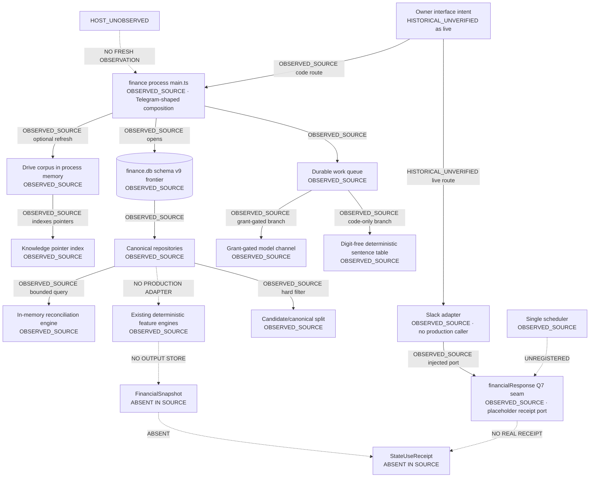
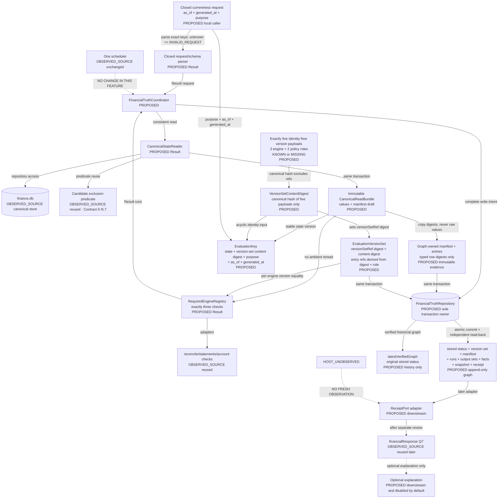
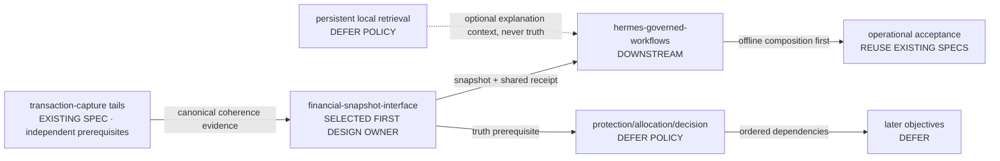

# Design: financial-snapshot-interface

Spec: `financial-snapshot-interface` · Workflow: design-first · Type: feature
Controller context: `NIZAM-HERMES-FINANCIAL-CONSULTANT-013`
Design detail: High-Level Design + Low-Level Design · Notation: TypeScript
Repository observation: branch `release/slack-finance-2026-09-22`, HEAD
`11d9d26d52bcfc428a393a5029d0457d9ebe31ad`
Working tree at discovery: one observed modification,
`src/lib/db/candidateFence.test.ts` (`18` insertions, `11` deletions). It is protected and untouched.

**Revision status: ACYCLIC IDENTITY AND REVIEW-STATE CORRECTIONS DESIGNED; NOT OWNER-ACCEPTED.**
`design.md` and `requirements.md` are both current review artifacts. The requirements are final detailed for
owner review; they are neither superseded nor pending re-derivation. Neither artifact is owner-accepted, and
review-state alignment grants no implementation authority. This revision changes `design.md` only and appends
immutable planning evidence. It does not revise `requirements.md` or `tasks.md`, implement behavior, run a
test or build, authorize a migration, change a human gate, access a host, bind a transport, ingest real data,
commit, push, deploy, or spend. Contract ownership and every policy gap listed in §11 and §16 remain open.

**Task safety: `tasks.md` is `SUPERSEDED_NON_EXECUTABLE`.** Its current fingerprint is recorded in the
append-only planning ledger. No existing task may run, even if its prose says `ready`. Regenerate the task
plan only after the owner accepts both current review artifacts.

**Selected owner:** `financial-snapshot-interface`, not `hermes-governed-workflows`. Current source has no
`FinancialSnapshot`, no `StateUseReceipt`, no corresponding tables, no durable engine-output references,
and no production PFOS read adapter. The Slack financial response explicitly uses a local placeholder
because the shared receipt does not exist. `hermes-governed-workflows` is therefore downstream.

---

## Overview

The selected journey, evidence vocabulary, and repository-evidence capability matrix are preserved in
§§1–3 below.

### 1. Scope and selected first-release journey

#### 1.1 Bounded journey: “Are my financial facts current?”

The first release answers one owner question without requiring a model:

> **Are my financial facts current enough to use?**

The answer is one of `CURRENT`, `LIMITED`, `STALE`, `UNKNOWN`, or a typed refusal. It is backed by:

1. candidate-excluded canonical facts read from `finance.db` in one immutable bundle;
2. immutable graph-owned canonical manifest entries containing typed row/content digests, never raw values;
3. one ordered `EvaluationVersionSet` with exactly five identity-free `KNOWN` or `MISSING` payloads: the
   three engine roles plus `MANIFEST_SCHEMA_POLICY` and `FRESHNESS_POLICY`;
4. existing deterministic account, statement, and reconciliation behavior where required inputs exist;
5. a versioned, reference-only `FinancialSnapshot`;
6. one shared `StateUseReceipt` that names stored status, manifest, version set, every engine run, source
   reference, freshness state, and unresolved item;
7. a downstream response adapter that may later expose the receipt to the approved owner interface.

This journey deliberately does **not** answer “how much can I spend?”, recommend a purchase, calculate a
protected floor, rank an alert by materiality, value an asset, or generate a recurring brief. Those require
policy or adapters that current repository evidence does not establish.

#### 1.2 Why this is the smallest useful slice

- It uses the canonical `finance.db` boundary without introducing another ledger or writer.
- It exercises existing deterministic behavior while recording unavailable required checks as `MISSING`, not
  zero; unsupported downstream engines do not run in this slice.
- It makes currentness and reconciliation explicit before any later financial recommendation.
- It unblocks the existing Slack Q7/meta response seam without authorizing Slack activation.
- It stays useful when all model access is unavailable.
- It creates the shared receipt base later objectives can extend instead of creating parallel receipts.

#### 1.3 Non-goals

- No amount-bearing Slack answer. Contract 14 §11 currently says no monetary amounts cross the companion
  policy boundary. The separate question-permission decision remains open.
- No model-authored financial fact, amount, freshness verdict, materiality verdict, or recommendation.
- No new scheduler, timer, cron, queue, ingress owner, transport, Drive writer, cache, or knowledge database.
- No candidate promotion, canonical transaction write, statement close, reconciliation mutation, mirror
  activation, or automatic alert.
- No broad 16-spec program. The controller roadmap is a proposal, not an instruction to create every spec.

---

### 2. Evidence vocabulary

| Label | Meaning in this design |
|---|---|
| **OBSERVED_SOURCE** | Read from the current working tree in this session. |
| **TEST_EXISTS** | A nearby test file or assertion exists. It was not run in this session. |
| **HISTORICAL_UNVERIFIED** | A document or receipt claims a past state; this session did not reproduce it. |
| **HOST_UNOBSERVED** | No host evidence was collected in this session. This does not mean the capability is absent. |
| **PROPOSED** | Target design only. No implementation or authority is implied. |
| **BLOCKED_POLICY** | Owner or contract policy is missing or contradictory. |

A test file is evidence that a behavior was specified, not evidence that it currently passes. A task-board
checkbox or deployment record is historical evidence, not a fresh source or live observation.

---

### 3. Repository-evidence capability matrix

| Capability | Source observation | Current implementation | Missing integration or feature | Governing contract / clause | Owner decision: reuse, extend, new, defer | Test existence, not pass | Historical deployment claim | Fresh live evidence | Acceptance evidence for the next boundary |
|---|---|---|---|---|---|---|---|---|---|
| Canonical financial store | **OBSERVED_SOURCE:** `openFinanceStore`, migrations 1–9, repositories under `src/server/db/` | `finance.db`, WAL/FULL/foreign-key checks, one connection factory | No whole-state identity or immutable historical manifest snapshot spanning the exact read set | `drive-db.md` canonical-store amendment; PFOS 06 §§2–5 | **Reuse; extend with stable state identity and graph-owned manifest evidence** | Store, migration, repository tests exist | Controller 011 claims a release baseline; not reproduced | **HOST_UNOBSERVED** | One read transaction returns an immutable bundle; graph persistence copies only typed row digests/refs into immutable graph-owned manifest entries so later canonical-row mutation cannot break historical resolution |
| Candidate exclusion | **OBSERVED_SOURCE:** `CandidatesRepository.listCanonicalForAccount` hard-filters `NOT (pending AND unverified)` | Server staging is the disjoint `transactions` subset `status = 'pending' AND verification_level = 'unverified'`; staged and canonical reads are separated by predicate | No production snapshot reader uses the canonical-only accessor; no all-account canonical read | Repository Contract 6 **I5.7.1–I5.7.5** (server authority), §5; PFOS 15 §4 | **Extend here** at the read adapter; do not change candidate code or the approved staging predicate | `candidateFence.test.ts`, `candidatesRepository.test.ts` exist; the former is user-modified and untouched | Task board claims prior green evidence | None needed | Every bundle and snapshot input excludes candidates; adding a candidate leaves state identity, evaluation output, snapshot, and receipt unchanged |
| Canonical account reads | **OBSERVED_SOURCE:** `AccountsRepository.list` | Reads current account rows and stored balance caches | No proof that stored caches reflect the latest posting; derived-update seam remains open in pipeline tasks | PFOS 03; pipeline S12 | **Reuse with status guard** | Repository and money-parity tests exist | Task board describes prior runs | **HOST_UNOBSERVED** | If the derived-update proof is absent, account-balance run is `MISSING` or `DEGRADED`, never current by assumption |
| Canonical transaction reads | **OBSERVED_SOURCE:** candidate-only accessor exists; general repository reads do not provide an all-account snapshot | Per-account reads and duplicate-key reads | Consistent all-account candidate-excluded read model | PFOS 02 §§4–5; PFOS 06 §3.2 | **Extend here** through an injected read port | Repository tests exist | Historical task evidence only | **HOST_UNOBSERVED** | All rows in the snapshot manifest satisfy the canonical predicate and retain provenance |
| Obligations | **OBSERVED_SOURCE:** `ObligationsRepository.list` | Persisted obligation subset, ordered by priority and due date | Browser engine fields such as penalty, protected reserve, confidence, and policy are absent from server rows | PFOS 03 §3; PFOS 06 §3.2 | **Defer full protection; not a required engine in this slice** | Repository and engine tests exist | No fresh deployment evidence | **HOST_UNOBSERVED** | Obligation protection produces no run or fact until its downstream policy and adapter are approved |
| Statements and reconciliation | **OBSERVED_SOURCE:** statement rows and `reconcile()` exist; no `statementClose.ts`; no persisted reconciliation report | Balance-equation close state and in-memory three-verdict comparison | Durable reconciliation result and current-snapshot relation; statement-close tail | PFOS 02 §5.3; pipeline requirements 2.12/2.12a | **Reuse current outputs; extend pipeline separately** | `statementsRepository` and `reconcile` tests exist | Pipeline board says partially delivered | **HOST_UNOBSERVED** | Absent durable reconciliation evidence yields `NOT_RECONCILED`/`UNKNOWN`, never `RECONCILED` |
| Existing deterministic engines | **OBSERVED_SOURCE:** safe-to-spend, forecast, budget, obligations, reports, and net-worth functions exist under `src/features/` | Pure deterministic functions over browser-shaped inputs | This slice needs only canonical account-state, statement-state, and reconciliation-evidence adapters; no immutable per-engine version set exists | PFOS 03 §§2–10 | **Reuse only the three required deterministic checks; add one content-addressed ordered version set with exactly five payloads; defer downstream engines without runs** | Engine unit tests and server money-parity tests exist | Historical test counts are not reused | No live engine observation | Exactly three ordered `EngineRun` records exist; each engine version equals its corresponding `EvaluationVersionSet` entry; all five fixed payloads must be `KNOWN` for `CURRENT`/`COMPLETE` |
| Derived graph evidence | **OBSERVED_SOURCE:** no durable output-ref, version-set, manifest-snapshot, snapshot, or receipt tables | Interface names exist only in spec prose | Immutable graph, stored status, content-addressed version set, graph-owned manifest entries, runs, output sets, facts, snapshot, and receipt under one repository unit of work | PFOS 03 §11; O1 §5.7/§10 proposal layer | **New inside existing snapshot spec under one repository owner** | No implementation test exists | None | None | Independent read-back compares stored status, acyclic set/entry identities and payloads, and every manifest/run/fact/snapshot/receipt row; evidence refs never resolve against mutable live rows |
| FinancialSnapshot | **OBSERVED_SOURCE:** no `src/server/state/`; no schema/table match | Design only | Builder, type, persistence, immutable stored status, and verified historical graph lookup | O1 §5.7; PFOS 06 schema authority is incomplete for this entity | **Extend this spec first** | No implementation test exists | Controller 011 calls it approved design, not built; that claim is not owner acceptance here | **HOST_UNOBSERVED** | One append-only graph per complete request identity; changing `as_of` or `generated_at` creates a new evaluation; historical lookup returns the stored original status without re-derivation |
| StateUseReceipt | **OBSERVED_SOURCE:** no module or table; `financialResponse.ts` says so | Local `AnchorEvidence` placeholder in companion code | Shared structurally closed receipt type and sole-repository adapter | O1 §10; D-W proposal for one shared base | **Extend this spec first** | `financialResponse.test.ts` tests the placeholder, not the shared receipt | None | None | Receipt carries stored status plus the content-addressed version-set ref and graph-owned manifest ref, typed refs, closed enums, bounds, validated times, and exactly three required runs |
| Financial currentness response | **OBSERVED_SOURCE:** `assembleFinancialResponse` and Q7/meta path exist behind ports | Reference/refusal/silence union, fixed 24-hour age check | Real receipt adapter; complete request identity reevaluation; production composition | Contract 14 §11 | **Reuse downstream after this spec** | `financialResponse.test.ts` exists | Supporting design claims offline tests ran; not reproduced | **HOST_UNOBSERVED** | A caller supplies `as_of` and `generated_at` and runs the policy/engine path; historical lookup returns immutable stored status but never relabels it current |
| Amount-bearing direct finance answer | **OBSERVED_SOURCE:** `PfosToolPort` is interface-only; `singleWindowFlow` is test-only; main worker uses digit-free sentence table | No production deterministic financial-result adapter | Resolve snapshot refs to deterministic facts and render under an approved question policy | Contract 14 §5 vs §11; PFOS 03 §1 | **Defer to hermes-governed-workflows after this spec and policy review** | Interface and offline-flow tests exist | No current live claim accepted | **HOST_UNOBSERVED** | Zero model calls on deterministic amount path; every digit traces to a stored deterministic fact |
| Slack ingress | **OBSERVED_SOURCE:** `createSlackSocketModeAdapter` has no non-test caller | Injected adapter, admission and sender ports | Socket client, durable Slack queue implementation, one process composition | Contract 14 §§1–8; Contract 12 transport | **Extend hermes-governed-workflows later** | `socketModeAdapter.test.ts` exists | `ops/SLACK_V2_RELEASE_RECORD.md` describes intended ownership only | **HOST_UNOBSERVED** | Exactly one observed consumer; duplicate envelope one effect; value-blind readiness |
| Current process entrypoint | **OBSERVED_SOURCE:** `main.ts` composes Telegram-shaped HTTP/poll transport and `answerDeterministically` | Running-shape code exists in repository | Reconciliation with Slack-only policy; no Slack composition root | Contract 14 says Slack-only; Contract 12 older Telegram topology | **Conflict; defer activation** | Main/process/transport tests exist | Historical records make several incompatible topology claims | **HOST_UNOBSERVED** | Source and live process ownership agree before any activation |
| Scheduler | **OBSERVED_SOURCE:** `SCHEDULER_TARGETS = ['life','finance']`; one clock | Payload-free independent ticks, bounded retry, kill checks | No current financial-snapshot consumer registry; `financialPillarTick` deliberately unregistered | Contract 12 §7/§8; Contract 14 §11 | **Reuse one clock; add consumer only in downstream spec** | Scheduler and financial-response tests exist | No fresh scheduler deployment evidence | **HOST_UNOBSERVED** | No new target/timer; duplicate tick produces no duplicate snapshot or send |
| Knowledge index | **OBSERVED_SOURCE:** 12 classes, pointer rows, hash identity, ordered-set refusal | `knowledgeIndex.ts`, document index repository | No role in the first currentness verdict; no persistent body cache owned by index | PFOS 05 §§3, 7; PFOS 06 §7 | **Reuse later; do not couple to snapshot** | Index/readiness tests exist | None relied on | **HOST_UNOBSERVED** | Retrieved context cannot change canonical version, freshness, or engine output |
| Profile memory and provenance | **OBSERVED_SOURCE:** caller-supplied local content resolver, hash/freshness/privacy validation | `profileMemoryLoader.ts`, `provenanceContext.ts` | Cache owner, restart lifecycle, refresh/eviction policy | PFOS 05 §7; Contract 06 §7 | **Reuse local boundary; defer new retrieval spec until policy exists** | Nearby tests exist | No live cache observation | **HOST_UNOBSERVED** | Cache miss is unavailable; stale/corrupt content refuses; local-only content never becomes model context |
| Drive knowledge | **OBSERVED_SOURCE:** read-only Google client; `DriveKnowledgeManager` holds corpus in process memory | Bounded traversal/retrieval, index pointers, untrusted labels | Persistent verified cache, restart survival, refresh cadence, retention, outage behavior | PFOS 05 §§9, 11; PFOS 06 §§7–8 | **Defer separate cache work** | Drive-knowledge tests exist | No fresh Drive use | **HOST_UNOBSERVED** | Local hash-verified cache survives restart and source outage before operational claim |
| Drive mirror | **OBSERVED_SOURCE:** candidate exclusion exists; steering records missing If-Match and tombstones | Browser projection path only | Concurrency-safe conditional write, tombstones, encrypted real-data activation, read-back evidence | `drive-db.md` amendment and open F6/F12 | **Extend transaction-capture-pipeline; not this slice** | Drive and boundary tests exist | Historical task claims only | No Drive access in session | No real mirror until F6/F12/encryption/read-back and owner gates are observed |
| Delivery/outbox | **OBSERVED_SOURCE:** migration 9 and notification outbox repository exist | Durable intent; at-least-once semantics | Snapshot creation itself sends nothing; downstream send reconciliation remains separate | PFOS 12 §5.5; controller 011 D-J record | **Reuse downstream** | Outbox tests exist | No live delivery evidence | **HOST_UNOBSERVED** | Snapshot/receipt commit is independent of notification delivery; no exactly-once delivery claim |
| Synthetic verification provenance | **OBSERVED_SOURCE:** tests and fixtures exist, but content inspection cannot prove provenance | No unforgeable fixture capability for this feature | Test-only `SyntheticFixtureCapability`, production-unconstructable composition, and a separate deployment-particular/content shape guard | Workspace synthetic-data rules; public-repository invariant | **New test-profile boundary in this spec; no production adapter** | No implementation test exists | None | None | Only the test fixture factory/build profile can construct the capability; production composition cannot accept it; shape scanning remains defense-in-depth rather than provenance proof |
| Task plan | **OBSERVED_SOURCE:** current `tasks.md` fingerprint is recorded in the planning ledger | Based on an earlier design state and not regenerated from the two current review artifacts | Complete regeneration after current design and final detailed requirements are owner-accepted | Design-first workflow | **Defer and prohibit execution** | Not applicable | Prior readiness labels are obsolete | None | `tasks.md` remains byte-for-byte unchanged and is treated as `SUPERSEDED_NON_EXECUTABLE`; no existing task runs |
| Operational readiness | **OBSERVED_SOURCE:** templates, health code, release records and baseline specs exist | Repository support artifacts | Numeric soak, latency, freshness, resource, RPO/RTO targets; fresh deployed digest/schema/process evidence | PFOS 12 §7; human gates | **Reuse existing operational specs; defer a new readiness spec** | Health/runbook tests exist | Historical claims only | **HOST_UNOBSERVED** | Fixed acceptance window and targets approved before any pass/fail readiness verdict |

#### 3.1 Controller 011/012 reconciliation

- Controller 011 exists. Its source-status claim that snapshot/receipt are unbuilt agrees with current source.
  Its “approved design” wording is historical and is not treated as owner acceptance or implementation
  authority in this revision. Its planned migrations 10 and 11 do **not** exist in `MIGRATIONS`, which
  currently ends at 9.
- No controller 012 artifact exists in `docs/kiro/prompts/`. No 012 finding is adopted from chat memory or
  inferred from the numbering gap.
- Controller 011’s clean-tree, test, remote, deployment, and live statements are historical claims only.
  This session observed only the branch, HEAD, one modified source test, current files, and no live system.

---

## Architecture

The evidence-labelled current and proposed architectures, their conclusions, and ownership boundaries are
preserved in §§4–5 below.

### 4. AS-IS architecture

Every node and edge carries an evidence label.



#### 4.1 AS-IS conclusions

1. The first missing dependency is the canonical snapshot/output/receipt boundary, not another model,
   prompt, transport, or agent.
2. Existing engines are available as code but are not production server adapters.
3. The source tree contains two transport stories: Contract 14 and the Slack adapter say Slack-only, while
   the current process entrypoint remains Telegram-shaped. Planning must not infer which is live.
4. The current Q7 seam can use a receipt once one exists. Q1–Q6 are deliberately refused before receipt
   access by `routeSlackFinancialConsultation`.

---

### 5. Proposed TO-BE architecture for this feature



#### 5.1 Ownership boundaries

| Boundary | Sole owner | Rule |
|---|---|---|
| Canonical monetary facts | Existing canonical repositories, led by `transactionsRepository` | This feature writes no canonical row and promotes no candidate. |
| Candidate exclusion | Existing candidate/canonical predicate | Every snapshot read must use it; no caller option may widen the read. |
| Request/schema parsing | Closed schema parser | Accepts exactly `asOf`, `generatedAt`, and `purpose`; unknown keys, including any effect/tool field, return `INVALID_REQUEST` before reads. |
| Consistent read bundle | `CanonicalStateReader` | One read transaction returns immutable materialized values plus a manifest draft; adapters may not ambiently reread. Every failure is a typed refusal. |
| Stable canonical identity | `CanonicalStateReader` | Hashes only approved, candidate-excluded canonical content; excludes `as_of`, `generated_at`, repository order, and candidate count. |
| Historical manifest evidence | `FinancialTruthRepository` | Copies typed table/row references and content digests, never raw values or sensitive text, into graph-owned immutable manifest rows. Historical evidence refs resolve only there. |
| Evaluation version identity | `EvaluationVersionSetRegistry` plus `FinancialTruthRepository` | Produces exactly five immutable, canonically ordered identity-free payloads: the three closed engine roles followed by `MANIFEST_SCHEMA_POLICY` and `FRESHNESS_POLICY`. It hashes only those payloads to `VersionSetContentDigest`, sets `versionSetRef.digest` to that digest, and derives each entry ref from the digest, ordinal, and closed role/artifact key. Runtime role extension is forbidden. |
| Time-relative evaluation identity | `FinancialTruthCoordinator` | Derives one `EvaluationKey` from canonical state, `VersionSetContentDigest`, purpose, caller `as_of`, and caller `generated_at`. It does not hash `versionSetRef` or entry refs. A changed `generated_at` is a new evaluation. |
| Graph-local identity | `FinancialTruthCoordinator` | Derives manifest, run, output-set, fact, snapshot, receipt, and graph child identities from `EvaluationKey`, a closed role tag, and deterministic ordinal or closed kind. It explicitly excludes `versionSetRef` and entry refs because those identities already derive acyclically before `EvaluationKey`. |
| Required engine execution | `RequiredEngineRegistry` | Runs exactly account-state, statement-state, and reconciliation-evidence checks; every run version equals its version-set entry; unsupported downstream engines are absent. |
| Derived graph persistence | `FinancialTruthRepository` | Sole unit-of-work owner for stored status, version set/entries, manifest/entries, runs, output sets, facts, snapshot, receipt, children, commit, lookup, and verification. |
| Freshness policy | Injected `FreshnessPolicyPort` | Resolves its policy entry through the same version set. No numeric window is invented. Missing policy yields `UNKNOWN`; refusal stays refusal. |
| Reconciliation evidence | Existing reconciliation/statement sources through an adapter | Missing durable proof is `UNKNOWN`; a failed required check is a typed refusal, never a pass. |
| Synthetic fixture authority | Test-only fixture factory/build profile | Only this factory can construct `SyntheticFixtureCapability`; production composition cannot supply it and production adapters are unavailable in that profile. Content scanning remains a separate shape guard. |
| Model explanation | Downstream Hermes workflow | Optional, after deterministic result and receipt; cannot modify status or facts. |
| Clock | Explicit caller | This feature creates no timer. Both `as_of` and `generated_at` are request identity fields; replay must reuse both exactly. |

---

## Components and Interfaces

The component responsibilities, ownership boundaries, TypeScript interfaces, and formal preconditions and
postconditions remain in §6.

### 6.1 Closed identifiers, references, and codes

Every persisted identifier is content-derived from an injected input tuple. There is no UUID, randomness,
process counter, ambient clock, or repository-generated identity.

```ts
export type Brand<T, Name extends string> = T & { readonly __brand: Name };
export type Sha256Hex = Brand<string, 'Sha256Hex'>; // exactly 64 lowercase hex characters
export type CanonicalStateVersion = Brand<Sha256Hex, 'CanonicalStateVersion'>;
export type EvaluationKey = Brand<Sha256Hex, 'EvaluationKey'>;
export type GraphId = Brand<Sha256Hex, 'GraphId'>;
export type UtcInstant = Brand<string, 'UtcInstant'>; // valid ISO 8601 UTC instant ending in Z

export const REF_TARGETS = [
  'ENGINE_RUN',
  'OUTPUT_SET',
  'DETERMINISTIC_FACT',
  'FINANCIAL_SNAPSHOT',
  'STATE_USE_RECEIPT',
  'CANONICAL_MANIFEST',
  'CANONICAL_EVIDENCE',
  'EVALUATION_VERSION_SET',
  'EVALUATION_VERSION_ENTRY',
  'CALCULATION_VERSION',
  'POLICY_VERSION',
] as const;
export type RefTarget = (typeof REF_TARGETS)[number];

export interface OpaqueRef<T extends RefTarget = RefTarget> {
  readonly target: T;
  readonly digest: Sha256Hex;
}

export const REQUIRED_ENGINES = [
  'CANONICAL_ACCOUNT_STATE',
  'STATEMENT_STATE',
  'RECONCILIATION_EVIDENCE',
] as const;
export type RequiredEngine = (typeof REQUIRED_ENGINES)[number];

export const REASON_CODES = [
  'EVIDENCE_CURRENT',
  'EVIDENCE_LIMITED',
  'EVIDENCE_STALE',
  'EVIDENCE_ABSENT',
  'EVIDENCE_FUTURE_DATED',
  'EVIDENCE_TIMESTAMP_INVALID',
  'FRESHNESS_POLICY_MISSING',
  'ACCOUNT_INPUT_MISSING',
  'STATEMENT_INPUT_MISSING',
  'RECONCILIATION_INPUT_MISSING',
  'RECONCILIATION_NOT_PERFORMED',
  'RECONCILIATION_RESIDUAL',
  'ENGINE_DEGRADED',
] as const;
export type ReasonCode = (typeof REASON_CODES)[number];

export const REFUSAL_CODES = [
  'INVALID_REQUEST',
  'UNAUTHORIZED_CALLER',
  'UNSUPPORTED_PURPOSE',
  'MANIFEST_POLICY_MISSING',
  'CANONICAL_READ_FAILED',
  'CANDIDATE_FENCE_FAILED',
  'CANONICAL_REREAD_CONFLICT',
  'VERSION_SET_VALIDATION_FAILED',
  'REQUIRED_ENGINE_FAILED',
  'FRESHNESS_POLICY_FAILED',
  'REFERENCE_VALIDATION_FAILED',
  'PRIVACY_VALIDATION_FAILED',
  'PERSISTENCE_FAILED',
  'STATE_VERSION_CONFLICT',
  'MANIFEST_READBACK_MISMATCH',
  'VERSION_SET_READBACK_MISMATCH',
  'STATUS_READBACK_MISMATCH',
  'SNAPSHOT_READBACK_MISMATCH',
  'RECEIPT_READBACK_MISMATCH',
] as const;
export type RefusalCode = (typeof REFUSAL_CODES)[number];

export interface Refused {
  readonly kind: 'REFUSED';
  readonly code: RefusalCode;
}

export type Result<T> = { readonly kind: 'OK'; readonly value: T } | Refused;

export interface ClosedSchemaParser<T> {
  parse(input: unknown): Result<T>;
}
```

Every fallible port returns `Result<T>` and never signals failure with null, an empty collection, a partial
object, or an untyped exception. Implementations may use an internal typed exception only if the port adapter
catches it at the boundary and maps it one-to-one to the closed code above. Schema parsing rejects unknown
keys. The request schema contains only `asOf`, `generatedAt`, and `purpose`; it has no effect, tool, transport,
or action field, so any such key is `INVALID_REQUEST` before a canonical read.

Repository validators enforce exact enum membership, exact 64-character lowercase SHA-256 digests, valid
UTC instants, target-table/class agreement, canonical ordering, and bounded collections before preparing SQL.
No receipt, manifest entry, version entry, or reference field accepts arbitrary text or raw canonical values.

| Reference target | Required resolution class |
|---|---|
| `ENGINE_RUN` | exactly one `deterministic_engine_runs` row |
| `OUTPUT_SET` | exactly one `deterministic_output_sets` row owned by the named run |
| `DETERMINISTIC_FACT` | exactly one `deterministic_output_facts` row owned by the named output set/run |
| `FINANCIAL_SNAPSHOT` | exactly one `financial_snapshots` row in the same derived graph |
| `STATE_USE_RECEIPT` | exactly one `state_use_receipts` row in the same derived graph |
| `CANONICAL_MANIFEST` | exactly one graph-owned immutable `canonical_manifests` row |
| `CANONICAL_EVIDENCE` | exactly one graph-owned immutable `canonical_manifest_entries` row; never a mutable live canonical row |
| `EVALUATION_VERSION_SET` | exactly one immutable content-addressed `evaluation_version_sets` row whose ref digest equals `VersionSetContentDigest` |
| `EVALUATION_VERSION_ENTRY` | exactly one of five ordered `evaluation_version_entries` rows owned by the named version set and derived from content digest, ordinal, and closed role/artifact key |
| `CALCULATION_VERSION` | exactly one `KNOWN` engine payload digest in the content-addressed version set |
| `POLICY_VERSION` | exactly one `KNOWN` policy payload digest in the content-addressed version set |

Unknown targets, engine names, reason codes, refusal codes, malformed identifiers, over-bound collections,
or cross-target references fail closed with a typed refusal.

### 6.2 CanonicalStateReader and immutable CanonicalReadBundle

**Purpose:** obtain one internally consistent, candidate-excluded value set and derive a stable content
identity from exactly those values inside the same read transaction.

```ts
export type CanonicalEvidenceClass = 'ACCOUNT' | 'TRANSACTION' | 'OBLIGATION' | 'STATEMENT' | 'FX_RATE';

export interface CanonicalManifestEntryDraft {
  readonly evidenceClass: CanonicalEvidenceClass;
  readonly ordinal: number;
  readonly sourceRowDigest: Sha256Hex;
  readonly canonicalContentDigest: Sha256Hex;
}

export interface CanonicalInputManifestDraft {
  readonly canonicalStateVersion: CanonicalStateVersion;
  readonly schemaMigrationHead: number;
  readonly entries: readonly CanonicalManifestEntryDraft[];
  readonly candidateCountObserved: number;
  readonly candidateRowsIncluded: 0;
}

export interface CanonicalReadValues {
  readonly accounts: readonly CanonicalAccountValue[];
  readonly transactions: readonly CanonicalTransactionValue[];
  readonly obligations: readonly CanonicalObligationValue[];
  readonly statements: readonly CanonicalStatementValue[];
  readonly fxRates: readonly CanonicalFxRateValue[];
}

export interface CanonicalReadBundle {
  readonly manifestDraft: CanonicalInputManifestDraft;
  readonly values: Readonly<CanonicalReadValues>;
}

export interface CanonicalStateReader {
  readBundle(): Result<CanonicalReadBundle>;
}

export interface DeterministicInputAdapter<T> {
  readonly engine: RequiredEngine;
  build(bundle: CanonicalReadBundle): Result<EngineInputResult<T>>;
}
```

**Preconditions**

- The store was opened through the existing connection factory.
- The currentness request's `asOf` is validated separately and is not an input to the canonical read or state
  identity.
- The reader uses one consistent SQLite read transaction.
- Repository Contract 6 I5.7.1–I5.7.5 defines the server candidate subset and requires every read to
  separate it from canonical rows.

**Postconditions**

- The transaction materializes the immutable values and computes the manifest draft before it closes.
- Candidate rows are counted for status but never included in values, entry digests, identity, or engine inputs.
- `canonicalStateVersion` hashes only the approved, canonically ordered consequential stored fields.
  It excludes `asOf`, `generatedAt`, repository return order, candidate count, and candidate content.
- The draft contains typed evidence class, deterministic ordinal, source-row digest, and canonical-content
  digest only. It contains no raw value, account name, payee, source text, or sensitive identifier.
- Repeating the read over unchanged canonical rows produces the same state version at any request time.
- Changing a consequential canonical field changes the state version.
- Engine adapters consume only the returned bundle and perform no ambient repository read.
- Every reader or adapter failure is a `Refused` result; no canonical row is written.

If an implementation cannot avoid a reread, it must read in a new consistent transaction, recompute every
row digest, compare the recomputed manifest to the bundle, and return `CANONICAL_REREAD_CONFLICT` before
calculation or persistence on any mismatch. A best-effort or unchecked reread is forbidden.

### 6.3 Immutable evaluation version set, request identity, and deterministic IDs

```ts
export const REQUIRED_POLICY_ARTIFACTS = [
  'MANIFEST_SCHEMA_POLICY',
  'FRESHNESS_POLICY',
] as const;
export type RequiredPolicyArtifact = (typeof REQUIRED_POLICY_ARTIFACTS)[number];

export const VERSION_ARTIFACT_KEYS = [
  'ENGINE:CANONICAL_ACCOUNT_STATE',
  'ENGINE:STATEMENT_STATE',
  'ENGINE:RECONCILIATION_EVIDENCE',
  'POLICY:MANIFEST_SCHEMA_POLICY',
  'POLICY:FRESHNESS_POLICY',
] as const;
export type VersionArtifactKey = (typeof VERSION_ARTIFACT_KEYS)[number];
export type VersionSetContentDigest = Brand<Sha256Hex, 'VersionSetContentDigest'>;

export type VersionEntryState<T extends 'CALCULATION_VERSION' | 'POLICY_VERSION'> =
  | { readonly state: 'KNOWN'; readonly versionRef: OpaqueRef<T> }
  | { readonly state: 'MISSING'; readonly versionRef: null };

export interface EvaluationVersionEntryPayload {
  readonly ordinal: number;
  readonly artifactKey: VersionArtifactKey;
  readonly artifactClass: 'ENGINE' | 'POLICY';
  readonly version: VersionEntryState<'CALCULATION_VERSION' | 'POLICY_VERSION'>;
}

export interface EvaluationVersionEntry extends EvaluationVersionEntryPayload {
  readonly entryRef: OpaqueRef<'EVALUATION_VERSION_ENTRY'>;
  readonly versionSetRef: OpaqueRef<'EVALUATION_VERSION_SET'>;
}

export interface EvaluationVersionSet {
  readonly contentDigest: VersionSetContentDigest;
  readonly versionSetRef: OpaqueRef<'EVALUATION_VERSION_SET'>;
  readonly payloads: readonly EvaluationVersionEntryPayload[];
  readonly entries: readonly EvaluationVersionEntry[];
}

export interface EvaluationVersionSetRegistry {
  resolveRequiredVersionSet(): Result<EvaluationVersionSet>;
}

export type Purpose = 'FINANCIAL_TRUTH_STATUS';

export interface EvaluationIdentityInput {
  readonly canonicalStateVersion: CanonicalStateVersion;
  readonly versionSetContentDigest: VersionSetContentDigest;
  readonly purpose: Purpose;
  readonly asOf: UtcInstant;
  readonly generatedAt: UtcInstant;
}

export interface EvaluationContext extends EvaluationIdentityInput {
  readonly evaluationKey: EvaluationKey;
  readonly versionSet: EvaluationVersionSet;
}
```

The role set is closed at exactly five entries for this feature: the three engine roles in `REQUIRED_ENGINES`
order, followed by `POLICY:MANIFEST_SCHEMA_POLICY` and `POLICY:FRESHNESS_POLICY` in
`REQUIRED_POLICY_ARTIFACTS` order. Each role has exactly one identity-free
`EvaluationVersionEntryPayload`. The two policy slots name required roles, not actual policy content or a
version. Until an approved artifact record is resolvable, its payload is `MISSING`; the design invents no
version, digest, threshold, or policy. Adding, removing, or replacing a role requires a reviewed revision of
this design and the current requirements. It cannot occur through configuration, persisted data, discovery,
or any other runtime path.

Version identity is acyclic and uses this exact order:

1. Construct the five canonical `EvaluationVersionEntryPayload` values. A payload contains only `ordinal`,
   `artifactKey`, `artifactClass`, and `version`; its `versionRef` is inside `VersionEntryState`.
2. Canonically encode and hash the ordered five payloads to `VersionSetContentDigest`. Payload hashing
   explicitly excludes `entryRef`, `versionSetRef`, `EvaluationKey`, graph identity, and every graph-local
   reference.
3. Set `versionSetRef.digest` equal to `VersionSetContentDigest`.
4. Derive each `entryRef.digest` from `(VersionSetContentDigest, ordinal,
   'EVALUATION_VERSION_ENTRY', artifactKey)`. The entry reference therefore depends on the payload digest,
   never the other way around.
5. Derive `EvaluationKey` from `(CanonicalStateVersion, VersionSetContentDigest, Purpose, asOf,
   generatedAt)`.
6. Derive graph-local identities from `(EvaluationKey, closed role tag, deterministic ordinal or closed
   kind)`. Graph-local identity derivation explicitly excludes `versionSetRef` and every `entryRef` because
   those identities were already derived acyclically before `EvaluationKey`.

`payloads` and `entries` must each have exactly five members and must agree field-for-field at each ordinal.
`versionSetRef.digest` must equal `contentDigest`; each entry's `versionSetRef` must equal the set reference;
and each `entryRef` must match step 4. Duplicate, omitted, extra, runtime-added, out-of-order, wrong-class,
payload/entry-mismatched, malformed, or unresolved `KNOWN` entries return
`VERSION_SET_VALIDATION_FAILED`.

`evaluationKey` is separate from `canonicalStateVersion`. Unchanged canonical rows with a different `asOf`,
`generatedAt`, or version-set content digest retain the same state identity and receive a different
evaluation key. Graph idempotency uses this complete request identity.

A retry is a retry only when it reuses the original `canonicalStateVersion`,
`VersionSetContentDigest`, `purpose`, `asOf`, and `generatedAt` exactly. The equivalent persisted
`versionSetRef` necessarily has that digest, but the reference object is not independently hashed into the
evaluation key. Supplying a new `generatedAt` creates a new evaluation and graph even when every other input
is unchanged. No port reads an ambient clock. Identical complete request identity and deterministic results
produce field-for-field identical write intent.

### 6.4 RequiredEngineRegistry

```ts
export type EngineRunStatus = 'PASS' | 'DEGRADED' | 'FAILED' | 'MISSING';

export type EngineInputResult<T> =
  | { readonly kind: 'AVAILABLE'; readonly value: T; readonly manifestEntryOrdinals: readonly number[] }
  | { readonly kind: 'MISSING'; readonly reason: Extract<ReasonCode,
      'ACCOUNT_INPUT_MISSING' | 'STATEMENT_INPUT_MISSING' | 'RECONCILIATION_INPUT_MISSING'> };

export interface EngineRunRef {
  readonly runRef: OpaqueRef<'ENGINE_RUN'>;
  readonly engine: RequiredEngine;
  readonly versionSetRef: OpaqueRef<'EVALUATION_VERSION_SET'>;
  readonly engineVersionEntryRef: OpaqueRef<'EVALUATION_VERSION_ENTRY'>;
  readonly engineVersion: VersionEntryState<'CALCULATION_VERSION'>;
  readonly status: EngineRunStatus;
  readonly evaluationKey: EvaluationKey;
  readonly inputStateVersion: CanonicalStateVersion;
  readonly outputSetRef: OpaqueRef<'OUTPUT_SET'> | null;
  readonly factRefs: readonly OpaqueRef<'DETERMINISTIC_FACT'>[];
  readonly evidenceRefs: readonly OpaqueRef<'CANONICAL_EVIDENCE'>[];
  readonly reasonCode: ReasonCode | null;
}

export interface RequiredEngineRegistry {
  runAll(
    bundle: CanonicalReadBundle,
    context: EvaluationContext,
    graphManifest: GraphCanonicalManifest,
  ): Result<readonly EngineRunRef[]>;
}
```

For `FINANCIAL_TRUTH_STATUS`, the required set is exactly:

1. `CANONICAL_ACCOUNT_STATE`: validates canonical account-state inputs and produces ordered account-balance
   fact refs plus freshness evidence inputs.
2. `STATEMENT_STATE`: determines statement presence/close/exception evidence using existing deterministic
   statement behavior.
3. `RECONCILIATION_EVIDENCE`: invokes the existing bounded reconciliation behavior only when its comparison
   inputs and mappings exist.

Safe-to-spend, forecast, budget, obligation protection, and net worth are downstream engines. They are not
registered, do not create runs, and cannot make this slice perpetually partial.

Every run's `engineVersionEntryRef` resolves to the unique `ENGINE:<engine>` entry in the same
`EvaluationVersionSet`, and the copied `engineVersion` must equal that entry field-for-field. A `KNOWN` run
version that does not resolve, or any mismatch, returns `VERSION_SET_VALIDATION_FAILED`. A missing engine
version entry remains `MISSING`; it cannot be replaced by a package label, commit hash, or inferred version.

A missing account input produces a `MISSING` run and `UNKNOWN` account freshness. Missing statement or
reconciliation inputs produce a `MISSING` run and `UNKNOWN` reconciliation. A `DEGRADED` run must carry a
known bounded result and narrows an otherwise usable result to `LIMITED`. Any `FAILED` required run or
registry refusal returns `REFUSED/REQUIRED_ENGINE_FAILED`; no graph is persisted. Every adapter-level
`Refused` result is propagated unchanged.

### 6.5 One FinancialTruthRepository unit of work

`FinancialTruthRepository` is the sole owner of every derived write and read. There is no separate
`EngineOutputRepository`, `SnapshotRepository`, or caller-managed partial append.

```ts
export type FactKind = 'ACCOUNT_BALANCE';

export interface GraphCanonicalManifestEntry {
  readonly evidenceRef: OpaqueRef<'CANONICAL_EVIDENCE'>;
  readonly manifestRef: OpaqueRef<'CANONICAL_MANIFEST'>;
  readonly evidenceClass: CanonicalEvidenceClass;
  readonly ordinal: number;
  readonly sourceRowDigest: Sha256Hex;
  readonly canonicalContentDigest: Sha256Hex;
}

export interface GraphCanonicalManifest {
  readonly manifestRef: OpaqueRef<'CANONICAL_MANIFEST'>;
  readonly evaluationKey: EvaluationKey;
  readonly canonicalStateVersion: CanonicalStateVersion;
  readonly schemaMigrationHead: number;
  readonly entries: readonly GraphCanonicalManifestEntry[];
  readonly candidateCountObserved: number;
  readonly candidateRowsIncluded: 0;
}

export interface DeterministicOutputFact {
  readonly factRef: OpaqueRef<'DETERMINISTIC_FACT'>;
  readonly outputSetRef: OpaqueRef<'OUTPUT_SET'>;
  readonly runRef: OpaqueRef<'ENGINE_RUN'>;
  readonly kind: FactKind;
  readonly ordinal: number;
  readonly amountMilliunits: Money;
  readonly currency: Brand<string, 'Iso4217Currency'>; // exactly three uppercase ASCII letters
  readonly computedAt: UtcInstant;
}

export interface EngineOutputSet {
  readonly outputSetRef: OpaqueRef<'OUTPUT_SET'>;
  readonly runRef: OpaqueRef<'ENGINE_RUN'>;
  readonly factRefs: readonly OpaqueRef<'DETERMINISTIC_FACT'>[];
}

export interface DerivedGraphWrite {
  readonly graphId: GraphId;
  readonly status: FinancialTruthStatus;
  readonly context: EvaluationContext;
  readonly versionSet: EvaluationVersionSet;
  readonly manifest: GraphCanonicalManifest;
  readonly runs: readonly EngineRunRef[];
  readonly outputSets: readonly EngineOutputSet[];
  readonly facts: readonly DeterministicOutputFact[];
  readonly snapshot: FinancialSnapshot;
  readonly receipt: StateUseReceipt;
}

export interface VerifiedDerivedGraph extends DerivedGraphWrite {
  readonly verification: 'READ_BACK_VERIFIED';
}

export interface FinancialTruthRepository {
  persistAndVerify(write: DerivedGraphWrite): Result<VerifiedDerivedGraph>;
  getVerifiedByEvaluationKey(key: EvaluationKey): Result<VerifiedDerivedGraph | null>;
  latestVerifiedGraph(): Result<VerifiedDerivedGraph | null>;
}
```

Each run owns zero or one `outputSetRef`. The output set owns the run's ordered `factRefs`; every fact repeats
its run, set, closed kind, and ordinal. A snapshot monetary field stores an explicit `factRef`, never only a
run or output-set ref. Every engine and policy version reference resolves through the immutable
content-addressed version set referenced by the graph. Every evidence reference resolves through the
graph-owned immutable manifest, never through a mutable live canonical table. Manifest entries carry digests and closed classes only, so later correction or
supersession of a canonical row cannot break historical receipt resolution or expose raw values.

The repository validates stored status, version set/entries, manifest/entries, run → output set → ordered
facts → snapshot fields → receipt graph before SQL and again after an independent complete read-back.
`FinancialTruthStatus` is an immutable scalar of `financial_truth_graphs`; the receipt copies it, and the
repository requires graph status, receipt status, and returned built status to match. Historical lookup returns
that stored value and never re-derives it from today's policy or mutable rows.

The repository first validates the exact five payloads, recomputes `VersionSetContentDigest`, and validates
all set and entry refs before SQL. In the graph transaction it inserts the immutable content-addressed set and
entries if absent, or reads and verifies a field-for-field identical existing set; a same-digest mismatch is
`STATE_VERSION_CONFLICT`. It then appends status, manifest/entries, runs, facts, snapshot, receipt, and all
graph-local child rows in that same transaction. No other repository may append or reuse one component. A
transaction commits the complete graph and its verified version-set dependency or none. All derived tables
are append-only and never mutate canonical tables. Every repository failure is represented by `Result<T>`
with one closed refusal code.

### 6.6 FinancialSnapshot

```ts
export type FreshnessState = 'FRESH' | 'LIMITED' | 'STALE' | 'UNKNOWN';
export type ReconciliationState =
  | 'RECONCILED'
  | 'RECONCILED_WITH_REPORTED_DISAGREEMENT'
  | 'UNEXPLAINED_RESIDUAL'
  | 'NOT_RECONCILED'
  | 'UNKNOWN';
export type MaterialityState = 'MATERIAL' | 'NON_MATERIAL' | 'UNKNOWN';

export interface AccountBalanceFactRef {
  readonly accountRef: OpaqueRef<'CANONICAL_EVIDENCE'>;
  readonly factRef: OpaqueRef<'DETERMINISTIC_FACT'>;
}

export interface AccountFreshness {
  readonly accountRef: OpaqueRef<'CANONICAL_EVIDENCE'>;
  readonly evidenceAsOf: UtcInstant | null;
  readonly state: FreshnessState;
  readonly policyVersionEntryRef: OpaqueRef<'EVALUATION_VERSION_ENTRY'> | null;
  readonly policyRef: OpaqueRef<'POLICY_VERSION'> | null;
  readonly reasonCode: ReasonCode;
}

export interface UnresolvedItem {
  readonly kind:
    | 'EVIDENCE_PENDING'
    | 'EVIDENCE_REJECTED'
    | 'EVIDENCE_CONFLICT'
    | 'SUSPECTED_DUPLICATE_UNRESOLVED'
    | 'RECONCILIATION_FINDING'
    | 'STATEMENT_OPEN'
    | 'STATEMENT_EXCEPTION_ACCEPTED'
    | 'ENGINE_INPUT_MISSING'
    | 'FRESHNESS_POLICY_MISSING';
  readonly ref: OpaqueRef<'CANONICAL_EVIDENCE'> | OpaqueRef<'ENGINE_RUN'>;
  readonly materiality: MaterialityState;
  readonly reasonCode: ReasonCode;
}

export interface FinancialSnapshot {
  readonly snapshotRef: OpaqueRef<'FINANCIAL_SNAPSHOT'>;
  readonly evaluationKey: EvaluationKey;
  readonly asOf: UtcInstant;
  readonly canonicalStateVersion: CanonicalStateVersion;
  readonly accountBalanceRefs: readonly AccountBalanceFactRef[];
  readonly availableCashFactRef: OpaqueRef<'DETERMINISTIC_FACT'> | null;
  readonly reservedCashFactRef: OpaqueRef<'DETERMINISTIC_FACT'> | null;
  readonly creditDueFactRef: OpaqueRef<'DETERMINISTIC_FACT'> | null;
  readonly totalDebtFactRef: OpaqueRef<'DETERMINISTIC_FACT'> | null;
  readonly next7dOutflowFactRef: OpaqueRef<'DETERMINISTIC_FACT'> | null;
  readonly next30dOutflowFactRef: OpaqueRef<'DETERMINISTIC_FACT'> | null;
  readonly expectedIncomeFactRef: OpaqueRef<'DETERMINISTIC_FACT'> | null;
  readonly budgetAvailableFactRef: OpaqueRef<'DETERMINISTIC_FACT'> | null;
  readonly liquidityBufferFactRef: OpaqueRef<'DETERMINISTIC_FACT'> | null;
  readonly unresolvedItems: readonly UnresolvedItem[];
  readonly versionSetRef: OpaqueRef<'EVALUATION_VERSION_SET'>;
  readonly manifestRef: OpaqueRef<'CANONICAL_MANIFEST'>;
  readonly freshness: readonly AccountFreshness[];
  readonly overallFreshness: FreshnessState;
  readonly overallReconciliation: ReconciliationState;
  readonly supersedesSnapshotRef: OpaqueRef<'FINANCIAL_SNAPSHOT'> | null;
}
```

This slice populates account-balance fact refs from the required account-state check. Unsupported downstream
monetary fields remain null and create no required-engine run. Materiality remains three-state. The snapshot
references the one immutable content-addressed version set and graph-owned immutable manifest. Missing
version entries remain explicit in the set. A partial snapshot reports missing required evidence in typed unresolved items; it never uses a
string such as `unknown` as a reference.

### 6.7 StateUseReceipt

```ts
export type CompletionStatus = 'COMPLETE' | 'PARTIAL';

export interface StateUseReceipt {
  readonly receiptRef: OpaqueRef<'STATE_USE_RECEIPT'>;
  readonly generatedAt: UtcInstant;
  readonly snapshotRef: OpaqueRef<'FINANCIAL_SNAPSHOT'>;
  readonly manifestRef: OpaqueRef<'CANONICAL_MANIFEST'>;
  readonly versionSetRef: OpaqueRef<'EVALUATION_VERSION_SET'>;
  readonly evaluationKey: EvaluationKey;
  readonly canonicalStateVersion: CanonicalStateVersion;
  readonly asOf: UtcInstant;
  readonly purpose: Purpose;
  readonly financialTruthStatus: FinancialTruthStatus;
  readonly overallFreshness: FreshnessState;
  readonly overallReconciliation: ReconciliationState;
  readonly engineRunRefs: readonly OpaqueRef<'ENGINE_RUN'>[];
  readonly evidenceRefs: readonly OpaqueRef<'CANONICAL_EVIDENCE'>[];
  readonly unresolvedMaterialItems: readonly UnresolvedItem[];
  readonly unresolvedUnknownMaterialityItems: readonly UnresolvedItem[];
  readonly completionStatus: CompletionStatus;
}
```

The receipt has no money field and no arbitrary string field. Its strings are branded digests, validated UTC
instants, or members of closed enums. Evidence references resolve only to immutable entries in the receipt's
graph-owned manifest. Engine and policy version references resolve only through the receipt's graph-owned
version set. Collection order is canonical and collection lengths are bounded by rows in the same persisted
graph. Repository validation rejects unknown keys after schema parsing, malformed or wrong-target refs,
unknown enum members, duplicate refs, non-canonical order, free text, and prohibited values before SQL. A
failed required engine produces no receipt, so `FAILED` is not a receipt completion state; it is a typed
coordinator refusal.

`COMPLETE` means all three required checks passed, all five fixed version-set payloads are `KNOWN`, and
every ref resolves. `PARTIAL` means no required check failed but at least one check is missing/degraded or at
least one of the five fixed payloads is `MISSING`. A missing version entry also makes the financial truth
status `UNKNOWN`. Completion does not claim the entire financial system is complete.

### 6.8 FreshnessPolicyPort and total status derivation

```ts
export interface FreshnessPolicyPort {
  classify(input: {
    readonly accountRef: OpaqueRef<'CANONICAL_EVIDENCE'>;
    readonly evidenceAsOf: UtcInstant | null;
    readonly snapshotAsOf: UtcInstant;
    readonly statementState: 'BALANCED' | 'OPEN' | 'EXCEPTION_ACCEPTED' | 'ABSENT';
    readonly policyVersionEntry: EvaluationVersionEntry;
  }): Result<AccountFreshness>;
}
```

No default age is invented. The port must receive the unique `POLICY:FRESHNESS_POLICY` entry from the
same content-addressed version set. A `MISSING` entry yields `UNKNOWN` plus `FRESHNESS_POLICY_MISSING`; a fallible
port refusal returns `FRESHNESS_POLICY_FAILED`. A `KNOWN` entry and `AccountFreshness.policyRef` must match
that set entry exactly. The fixed 24-hour downstream constant is not financial-truth policy.

Overall freshness is total and uses this precedence: `STALE` > `UNKNOWN` > `LIMITED` > `FRESH`. Empty
required-account input is `UNKNOWN`, not `FRESH`.

The coordinator applies the following exhaustive precedence exactly once, top to bottom:

| Priority | Exhaustive condition | Outcome |
|---|---|---|
| 1 | request/schema/caller/purpose invalid; canonical or candidate fence fails; version set invalid; any fallible port refuses; any required engine is `FAILED`; graph validation/persistence/read-back fails | typed `REFUSED` with the mapped closed code; persist no new graph on pre-persistence failure |
| 2 | no refusal and overall freshness is `STALE` | built `STALE` |
| 3 | no refusal/stale and any required engine or policy version-set entry is `MISSING`, overall freshness is `UNKNOWN`, required canonical account evidence is unknown, or reconciliation is `UNKNOWN` | built `UNKNOWN` with receipt `PARTIAL` |
| 4 | no prior condition and overall freshness is `LIMITED` | built `LIMITED` |
| 5 | no prior condition and any required engine is `MISSING` or `DEGRADED` | built `LIMITED` with receipt `PARTIAL` |
| 6 | no prior condition and reconciliation is `RECONCILED_WITH_REPORTED_DISAGREEMENT`, `UNEXPLAINED_RESIDUAL`, or `NOT_RECONCILED` | built `LIMITED` |
| 7 | all required freshness is `FRESH`, reconciliation is `RECONCILED`, all three required engines are `PASS`, candidate inclusion is zero, and all five fixed version-set payloads are `KNOWN` and resolvable | built `CURRENT` with receipt `COMPLETE` |

The table is total because every request either refuses, has one of four aggregate freshness states, has one
of four engine statuses for each of the closed required engines, and has one of five reconciliation states.
After priorities 1–6, only the priority-7 conjunction remains; failure to satisfy it is
`REFUSED/REFERENCE_VALIDATION_FAILED`, not an unclassified outcome.

### 6.9 FinancialTruthCoordinator and historical lookup

```ts
export type FinancialTruthStatus = 'CURRENT' | 'LIMITED' | 'STALE' | 'UNKNOWN';

export interface FinancialTruthRequest {
  readonly asOf: UtcInstant;
  readonly generatedAt: UtcInstant;
  readonly purpose: Purpose;
}

export interface BuiltFinancialTruth {
  readonly status: FinancialTruthStatus;
  readonly graph: VerifiedDerivedGraph;
}

export interface FinancialTruthCoordinator {
  build(input: unknown): Result<BuiltFinancialTruth>;
  latestVerifiedGraph(): Result<VerifiedDerivedGraph | null>;
}
```

`build` first parses `unknown` through the closed `FinancialTruthRequest` schema. Unknown keys are
`INVALID_REQUEST`; there is no requestable effect, tool, action, transport, or external-call behavior.
The coordinator propagates every port refusal without converting it to `UNKNOWN`, `MISSING`, or an empty
success.

`latestVerifiedGraph()` is an audit/history lookup, not a currentness API. It returns a complete verified
graph and its immutable `financial_truth_graphs.status` exactly as stored with the original `asOf` and
`generatedAt`. It never re-derives status from current policy, current engine code, or mutable canonical rows.
A caller that asks whether facts are current must submit a new complete request identity to `build`. Reusing
both original times is an idempotent replay; changing either time creates a new evaluation. A stored `CURRENT`
label remains historical evidence only.

---

## Data Models

The immutable canonical read bundle and manifest draft, stable state identity, graph-owned canonical manifest,
ordered evaluation version set, complete evaluation key, stored financial-truth status, required-engine runs,
ordered output sets, explicit fact references, `FinancialSnapshot`, `StateUseReceipt`, freshness
classifications, unresolved-item states, closed refusal results, and coordinator types are defined in
§§6.1–6.9. Their additive persistence model and migration implications are preserved in §7.

## 7. Persistence and migration implications

### 7.1 Current frontier

Current `MIGRATIONS` ends at version 9 (`notification_outbox`). Controller 011 proposes audit hardening as
migration 10 and snapshot tables as migration 11, but neither exists in source. This design does not reserve
or write a migration number. Implementation must serialize with the transaction-pipeline migration frontier
and append the next available version. Applied migrations are never edited.

### 7.2 Proposed additive tables

| Table | Content | Money columns | Write rule |
|---|---|---|---|
| `financial_truth_graphs` | graph identity, evaluation key, immutable `financial_truth_status`, purpose, `as_of`, `generated_at`, version-set content digest/ref, manifest ref | none | append-only; one row per complete evaluation key |
| `evaluation_version_sets` | content-addressed identity where `version_set_ref.digest = VersionSetContentDigest` | none | immutable append-only row persisted or exactly reused under sole repository ownership |
| `evaluation_version_entries` | exactly five ordered identity-free payloads plus acyclic refs derived from content digest, ordinal, and closed role/artifact key | none | immutable child rows; payload hash excludes set and entry refs; runtime role extension forbidden |
| `canonical_manifests` | graph-owned manifest identity, canonical state version, schema head, candidate observation metadata | none | append-only; no raw canonical values |
| `canonical_manifest_entries` | typed evidence class, ordinal, source-row digest, canonical-content digest | none | append-only child rows; immutable evidence target |
| `deterministic_engine_runs` | run identity, engine version-set entry ref/value, evaluation key, input state version, status, output-set ref, reason code | none | append-only through `FinancialTruthRepository` |
| `deterministic_output_sets` | one run-owned ordered output-set identity | none | append-only child row |
| `deterministic_output_facts` | output-set/run-owned closed facts with deterministic ordinal | `amount_milliunits INTEGER` | guarded before statement; append-only |
| `financial_snapshots` | scalar snapshot identity/version/freshness/reconciliation plus version-set and manifest refs | none | append-only graph child |
| `snapshot_fact_refs` | closed snapshot field, explicit fact ref, deterministic order | none | append-only child rows |
| `snapshot_account_freshness` | account evidence ref, evidence time, state, policy version-entry ref, reason enum | none | append-only child rows |
| `snapshot_unresolved_items` | closed kind, typed graph-owned evidence/run ref, three-state materiality, reason enum | none | append-only child rows |
| `state_use_receipts` | receipt scalar fields, stored status, purpose, evaluation key, version-set/manifest refs, completion status | none | append-only graph child |
| `receipt_engine_runs` | ordered typed run refs | none | append-only child rows |
| `receipt_evidence_refs` | ordered refs to graph-owned manifest entries | none | append-only child rows |
| `receipt_unresolved_items` | unresolved typed refs copied by identity, not narrative | none | append-only child rows |

No free-form JSON stores monetary facts, raw manifest values, version data, or receipt values. No table has
update/delete methods. Append-only triggers follow the existing decisions/spend-ledger pattern.
`FinancialTruthRepository.persistAndVerify` owns every derived insert and writes the graph in one
`withTransaction` call, then independently reads back and compares the status, version set and all entries,
manifest and all entries, runs, output sets, facts, snapshot, receipt, and every child row.

### 7.3 Evaluation-key uniqueness and idempotence

```sql
UNIQUE (evaluation_key)
```

The evaluation key includes canonical state version, `VersionSetContentDigest`, declared purpose, caller
`as_of`, and caller `generated_at`. The equivalent `versionSetRef.digest` equals that content digest, but the
reference and entry refs are not separately included in the evaluation-key hash. A conflict-ignoring insert
followed by complete graph read-back makes the insert the decision. Identical replay must reuse all five
original identity fields and returns the existing verified graph. Different content for the same evaluation
key returns `STATE_VERSION_CONFLICT`. The repository never overwrites, merges, or creates a second graph for
one key. Changing `as_of`, `generated_at`, or version-set payload content creates a new evaluation key even
when canonical rows are unchanged.

### 7.4 Canonical write separation

These tables are derived read models. They never mutate `accounts`, `transactions`, `obligations`,
`statements`, `source_events`, or `transaction_links`. Their repository is not a second canonical writer.
A later snapshot supersedes by reference; it does not edit the prior snapshot.

---

## 8. Success, interruption, and recovery sequences

### 8.1 Successful local build

```mermaid
sequenceDiagram
  actor Caller as Local Caller [PROPOSED]
  participant P as Closed Schema Parser [PROPOSED]
  participant C as Coordinator [PROPOSED]
  participant R as Canonical Reader [PROPOSED]
  participant V as Version Set Registry [PROPOSED]
  participant DB as finance.db [OBSERVED_SOURCE]
  participant E as Required Engine Registry [PROPOSED]
  participant U as FinancialTruthRepository [PROPOSED]

  Caller->>P: {asOf, generatedAt, purpose} [PROPOSED]
  P-->>C: Result<FinancialTruthRequest> [PROPOSED]
  C->>R: readBundle() [PROPOSED]
  R->>DB: one consistent candidate-excluded read [PROPOSED]
  DB-->>R: canonical rows + candidate count [OBSERVED_SOURCE capability]
  R-->>C: Result<immutable values + manifest draft> [PROPOSED]
  C->>V: resolve exactly five version payloads [PROPOSED]
  V->>V: hash payloads only to VersionSetContentDigest [PROPOSED]
  V->>V: set versionSetRef.digest; derive entry refs from digest + ordinal + role
  V-->>C: Result<acyclic content-addressed version set> [PROPOSED]
  C->>C: derive evaluationKey(state, VersionSetContentDigest, purpose, asOf, generatedAt)
  C->>C: derive graph-local refs from evaluationKey; exclude versionSetRef and entryRefs
  C->>C: derive graph-owned manifest refs from evaluationKey + draft
  C->>E: runAll(bundle, context, graphManifest) [PROPOSED]
  E-->>C: Result<exactly three version-matched runs> [PROPOSED]
  C->>C: derive total status + completion
  C->>U: persistAndVerify(status + version set + manifest + complete graph)
  U->>DB: one atomic append-only transaction [PROPOSED]
  U->>DB: independent complete graph read-back [PROPOSED]
  DB-->>U: stored status and every graph row [PROPOSED]
  U-->>C: Result<READ_BACK_VERIFIED graph> [PROPOSED]
  C-->>Caller: Result<CURRENT|LIMITED|STALE|UNKNOWN graph> [PROPOSED]
```

### 8.2 Missing policy or required input

```mermaid
sequenceDiagram
  participant C as Coordinator [PROPOSED]
  participant V as Version Set Registry [PROPOSED]
  participant E as Required Engine Registry [PROPOSED]
  participant U as FinancialTruthRepository [PROPOSED]
  C->>V: resolve exactly five required role payloads
  V->>V: hash identity-free payloads; derive set and entry refs acyclically
  V-->>C: one or more payloads MISSING
  C->>E: run exactly three required checks [PROPOSED]
  E-->>C: Result with PASS/MISSING/DEGRADED runs [PROPOSED]
  C->>U: append UNKNOWN + PARTIAL graph when otherwise valid
  U-->>C: Result<read-back verified status/version set/manifest/graph>
  Note over C: Missing version or evidence stays missing, never zero/current
  C-->>C: any required version MISSING => UNKNOWN/PARTIAL
```

Unsupported downstream engines produce no run. A failed required check or any fallible-port refusal persists
no graph and returns its mapped closed code.

### 8.3 Crash before commit

The transaction rolls back. No status, version set, manifest, run, snapshot, or receipt row exists. A retry
must reuse the complete original request identity, including both `as_of` and `generated_at`; it recomputes
the same write intent and may append once. The caller receives no success before independent read-back.

### 8.4 Crash after commit before response

The retry reuses the exact original canonical state, `VersionSetContentDigest`, purpose, `as_of`, and
`generated_at`, derives the same evaluation key and graph-local deterministic identities, and separately
reconstructs the same acyclic `versionSetRef` and entry refs from the five payloads. It hits the uniqueness
constraint, independently reads back the existing complete graph, and returns its stored original status. No
second graph is written. Changing `as_of`, `generated_at`, or version-set payload content creates a new
evaluation rather than a replay.

### 8.5 Canonical state changes during build

The reader's consistent transaction freezes the manifest draft and materialized bundle consumed by all
required checks. Persistence copies the draft's typed digests into graph-owned immutable manifest rows.
Outputs and receipt cite that graph-owned evidence, state version, version set, and evaluation key. Later
canonical-row mutation cannot break historical resolution because historical lookup never resolves evidence
against live rows. A later call with changed canonical content, `as_of`, `generated_at`, or
`VersionSetContentDigest` appends a successor. The first graph retains its stored original status and is never
silently relabelled.

### 8.6 Downstream model unavailable

The selected journey returns the deterministic status and receipt without calling a model. Optional model
explanation is a separate downstream step. Its failure cannot erase, alter, or downgrade the deterministic
result.

### 8.7 Synthetic verification profile

```ts
export declare const syntheticFixtureCapabilityBrand: unique symbol;

export interface SyntheticFixtureCapability {
  readonly [syntheticFixtureCapabilityBrand]: 'TEST_FIXTURE_FACTORY_ONLY';
}

export interface SyntheticFixtureFactory {
  createCapability(): SyntheticFixtureCapability;
  createStore(capability: SyntheticFixtureCapability): Result<SyntheticFinanceStore>;
}

export interface SyntheticShapeGuard {
  scan(input: unknown): Result<'SHAPE_ACCEPTED'>;
}
```

The capability constructor is not exported from production modules and is wired only by the test fixture
factory in the synthetic build profile. Production composition cannot accept or construct this capability.
The synthetic profile omits production canonical-store, transport, provider, Drive, model, and host adapters,
so a fixture cannot fall through to a live boundary.

`SyntheticShapeGuard` separately rejects deployment particulars and prohibited content shapes. It is
defense-in-depth, not provenance proof: passing a content scan does not make data synthetic. Only possession
of the unforgeable test-profile capability admits the synthetic verification path. The design never attempts
to infer real-versus-synthetic provenance from amounts, names, identifiers, or text.

---

## Error Handling

The privacy boundary, typed failure outcomes, and explicit no-fallback rules are preserved in §9.

### 9. Privacy and error semantics

#### 9.1 Privacy

- Snapshot and receipt store branded typed references, closed statuses, a version-set reference, bounded
  ordered collections, validated UTC instants, and closed reason codes, not account names, payees, source
  text, chat text, secrets, or arbitrary strings.
- Graph-owned canonical manifest entries store typed evidence class, order, source-row digest, and
  canonical-content digest only. They store no raw canonical value or sensitive text.
- Content-addressed version entries store the fixed five closed artifact roles and `KNOWN` digests/refs or
  `MISSING`; no port invents a version or policy, and no runtime path adds a role.
- Repository schemas reject unknown keys and `additionalProperties`; identifiers are target-class plus exact
  SHA-256 digest and every enum is closed.
- Amounts exist only in deterministic fact rows and never in receipt metadata, manifest entries, version
  entries, knowledge context, logs, signals, or model prompts.
- Diagnostic output carries typed refs, status enums, and closed error codes only.
- Knowledge retrieval is not consulted to determine canonical financial truth.
- Synthetic provenance comes only from the test-profile capability. Deployment-particular/content scanning
  is a separate shape guard and cannot prove provenance.
- Drive is not used by this local slice. Any later mirror remains subject to `drive.file`, encryption,
  candidate exclusion, If-Match/tombstone safety, and read-back.

#### 9.2 Error table

| Condition | Result | No fallback |
|---|---|---|
| Request has an invalid instant, unsupported purpose, or unknown key such as effect/tool/action | `REFUSED/INVALID_REQUEST` or `REFUSED/UNSUPPORTED_PURPOSE` before reads | No requestable effect surface exists |
| Canonical reader fails | `REFUSED/CANONICAL_READ_FAILED` | No cached or Drive value is substituted |
| Candidate appears in engine input | `REFUSED/CANDIDATE_FENCE_FAILED` | Candidate is not ignored after calculation; calculation never runs |
| Version set is incomplete structurally, duplicated, out of order, wrong-class, or has an unresolved `KNOWN` entry | `REFUSED/VERSION_SET_VALIDATION_FAILED` | No inferred package, commit, engine, or policy version |
| A required engine or policy version entry is validly `MISSING` | status `UNKNOWN`, receipt `PARTIAL`, named missing evidence | No invented version or `CURRENT`/`COMPLETE` result |
| Freshness policy version is missing | snapshot `UNKNOWN`, receipt `PARTIAL`, named unresolved item | No default time window |
| Freshness policy port refuses | `REFUSED/FRESHNESS_POLICY_FAILED` | No conversion to unknown success |
| Required engine input missing | typed `MISSING`; account/reconciliation unknown yields `UNKNOWN`, otherwise bounded known degradation yields `LIMITED` | No zero output, unsupported downstream run, or model estimate |
| Required engine registry/adapter fails | `REFUSED/REQUIRED_ENGINE_FAILED` or propagated closed refusal; no graph | No failed receipt or partial-success label |
| Reconciliation proof absent | `UNKNOWN` or `NOT_RECONCILED` | No inferred clean state |
| Version/evaluation key collision with different content | `REFUSED/STATE_VERSION_CONFLICT` | No overwrite |
| Unchecked or digest-mismatched reread | `REFUSED/CANONICAL_REREAD_CONFLICT` | No calculation from mixed read instants |
| Malformed/wrong-target ref, unknown enum/key, free text, or prohibited value | `REFUSED/REFERENCE_VALIDATION_FAILED` or `REFUSED/PRIVACY_VALIDATION_FAILED` before SQL | No permissive parse or truncation |
| Repository transaction fails | `REFUSED/PERSISTENCE_FAILED` | No partial graph or success acknowledgement |
| Stored manifest/version set/status differs on read-back | `REFUSED/MANIFEST_READBACK_MISMATCH`, `VERSION_SET_READBACK_MISMATCH`, or `STATUS_READBACK_MISMATCH` | No live-row resolution or status re-derivation |
| Snapshot/receipt read-back mismatch | typed snapshot/receipt refusal | No success acknowledgement |
| Synthetic capability absent or forged | `REFUSED/INVALID_REQUEST` before fixture-store construction | Passing a shape scan does not grant capability |
| Downstream model unavailable | deterministic stored status remains unchanged | No requirement to call a model |

#### 9.3 Fallible-port refusal map

| Boundary | Closed result mapping |
|---|---|
| Request schema parser | invalid instant, unknown key, malformed structure → `INVALID_REQUEST`; unsupported closed purpose → `UNSUPPORTED_PURPOSE` |
| Caller admission | caller not admitted → `UNAUTHORIZED_CALLER` |
| CanonicalStateReader | store/read failure → `CANONICAL_READ_FAILED`; candidate leak → `CANDIDATE_FENCE_FAILED`; unavailable manifest schema → `MANIFEST_POLICY_MISSING`; reread mismatch → `CANONICAL_REREAD_CONFLICT` |
| EvaluationVersionSetRegistry | malformed, incomplete, duplicate, out-of-order, wrong-class, or unresolved `KNOWN` entry → `VERSION_SET_VALIDATION_FAILED` |
| RequiredEngineRegistry and engine adapters | exception, failed required run, or invalid adapter result → `REQUIRED_ENGINE_FAILED`; an intentional absent input remains successful `MISSING`, not a refusal |
| FreshnessPolicyPort | port exception, malformed result, or mismatch with its version-set entry → `FRESHNESS_POLICY_FAILED`; an intentional missing policy entry remains successful `UNKNOWN/PARTIAL` |
| Structural privacy/reference parser | prohibited/free-form value → `PRIVACY_VALIDATION_FAILED`; malformed/wrong-target graph reference → `REFERENCE_VALIDATION_FAILED` |
| FinancialTruthRepository write | transaction/statement failure → `PERSISTENCE_FAILED`; same key with different graph → `STATE_VERSION_CONFLICT` |
| FinancialTruthRepository read-back | manifest → `MANIFEST_READBACK_MISMATCH`; version set → `VERSION_SET_READBACK_MISMATCH`; stored status → `STATUS_READBACK_MISMATCH`; snapshot → `SNAPSHOT_READBACK_MISMATCH`; receipt → `RECEIPT_READBACK_MISMATCH`; any other graph mismatch → `REFERENCE_VALIDATION_FAILED` |
| FinancialTruthCoordinator | propagates the originating closed code; an otherwise unreachable state → `REFERENCE_VALIDATION_FAILED` |

---

## 10. Smallest dependency-ordered spec map

The 16-row controller roadmap is reduced to the smallest current map. “New later” does not authorize creation
now.

| Roadmap capability | Decision | Owning spec | Dependency / reason |
|---|---|---|---|
| S01 Transaction capture pipeline | **Extend existing** | `transaction-capture-pipeline` | Finish statement-close, derived-update, mirror concurrency/tombstone, and failure-injection tails independently. Existing candidate exclusion is reused. |
| S02 Snapshot and shared receipt | **Extend existing first for this controller** | `financial-snapshot-interface` | Missing boundary used by every consultation and later objective. This design is the selected update. |
| S03 Governed runtime | **Extend existing second** | `hermes-governed-workflows` | Depends on resolvable snapshot/receipt and a production deterministic adapter. Current design contains stale branch/topology assumptions. |
| S04 Local financial retrieval | **Reuse current modules; defer new spec** | PFOS 05/06 plus `provenanceContext.ts`, `driveKnowledge.ts` | Persistent cache owner/lifecycle/retention and outage behavior lack policy. First journey needs no knowledge retrieval. |
| S05 Consultation and visual explanation | **Reuse/extend S03; no new spec now** | `hermes-governed-workflows` | One bounded Q7 journey fits existing financial-response seam. Visuals and broader classes wait for question permission and output contracts. |
| S06 Operational readiness | **Reuse existing specs; defer new spec** | `agentic-profile-baseline`, `telegram-window`, release records, Contract 12 | Avoid a second supervisor/readiness authority. Numeric soak and SLO targets are missing. |
| S07 Financial protection | **New later, deferred** | future protection spec | Blocked on approved protected-floor and materiality interfaces; consumes S02. |
| S08 Capital allocation | **New later, deferred** | future capital-allocation spec | Depends on protection state and approved allocatable/protected-capital policy. |
| S09 Decision support | **Extend existing deterministic decisions, new wrapper later** | future decision-support spec over `src/features/decisions/` | Depends on S07/S08 and question/action gates; no duplicate decision ledger. |
| S10 Wealth goals and trajectory | **New later, deferred** | future wealth-trajectory spec | Blocked on valuation sources/cadence and realized/projected taxonomy. |
| S11 Briefs and open loops | **New later, deferred** | future briefs spec | Blocked on cadence, suppression, destination, and materiality policy; must consume the one scheduler. |
| S12 Regime management | **Deferred** | no spec now | The objective itself records missing numeric thresholds, dwell, and policy. Contract must precede implementation. |
| S13 Longitudinal intelligence | **Deferred** | no spec now | Needs S02 receipts, history windows, retention/coverage semantics, and forecast evaluation policy. |
| S14 Merchant/behavioral intelligence | **Defer and resolve ownership** | PFOS 03 currently claims leak/behavioral intelligence | O9 overlaps PFOS 03 and no canonical Merchant entity exists. |
| S15 Cross-domain decisions | **Deferred** | no spec now | D-Q/HIMAYAH privacy authority and causal/association policy unresolved. |
| S16 Evidence reasoning | **Deferred** | no spec now | Shared receipt begins here; broader claim/confidence/contradiction policy lacks a current owning contract. PFOS 08 is absent. |

### 10.1 Dependency graph



**Decision on provisional owner:** `hermes-governed-workflows` is **not** the first dependency-ready owner.
It is the correct downstream owner for governed question routing, explanation, and transport composition.
`financial-snapshot-interface` is the correct existing owner for the first missing dependency.

---

## 11. Authority, conflict, and unresolved-policy register

No row below is decided by this design unless the resolution is a repository-observed technical boundary.

| ID | Subject | Exact authority / source clauses | Repository observation | Status / owner action needed |
|---|---|---|---|---|
| A01 | Financial question permission | Contract 14 §5: money/budget/debt/forecast/balance route to PFOS and an LLM may explain but not choose a figure. Contract 14 §11: “No monetary amounts or arbitrary source text cross this policy boundary. Financial alerts require PFOS provenance; unavailable PFOS means unavailable, not zero.” | `routeSlackFinancialConsultation` permits Q7 only; Q1–Q6 refuse before receipt access. `PfosToolPort` is interface-only. | **BLOCKED_POLICY.** Decide direct amount-bearing owner response separately from companion/reference response. Do not route amounts through `FinancialResponse` meanwhile. |
| A02 | Local retention versus source retention | PFOS 06 §8.2 uses placeholders `<SOURCE_EVENT_RETENTION_DAYS>`, `<TELEMETRY_RETENTION_DAYS>`, `<DEDUP_RETENTION_DAYS>`, `<WORK_QUEUE_RETENTION_HOURS>` and requires floors. | No numeric source/cache/queue policy is established by this session. | Owner/contract must set windows before operational acceptance. Snapshot/receipt history is proposed indefinite append-only unless contract review says otherwise. |
| A03 | Local-only versus model egress | PFOS 05 §2: journal/health are `local_only` and never sent to model; finance profile includes transaction/statement/financial/contract/operational only. PFOS 05 §7 applies `canProfileRead`/`canSendToCloud`. | `provenanceContext.ts` enforces profile/privacy/hash/freshness. `driveKnowledge.ts` can form untrusted text context. | Preserve. Knowledge cannot influence canonical status. Any model explanation receives only separately approved context. |
| A04 | Cache ownership and lifecycle | PFOS 05 §7 says the memory loader reads an existing index and fetching is separate. PFOS 06 §7 says the store indexes pointers, not bodies. | `DriveKnowledgeManager` owns only an in-process `corpus`; `profileMemoryLoader` and `provenanceContext` depend on caller-owned content resolvers. No persistent body cache owner, restart lifecycle, eviction, refresh receipt, or outage contract. | **BLOCKED_POLICY** for a new retrieval spec. Defer from first journey. |
| A05 | Protected floor | PFOS 03 §2 defines safe-to-spend terms including minimum liquidity buffer. O2 §8 says O2 does not invent the floor and consumes a later O15 Dynamic Resilience output. | Existing safe-to-spend code exists, but the later protected-floor authority is not present as a current contract/spec. | Do not state a floor or floor breach in this slice. Future O2/O4 work blocked on owner-approved policy. |
| A06 | Materiality | O2 §7 says later O28 supplies multidimensional materiality; until then only existing deterministic/contractual rules may be provisional. | No O28 contract or engine in current source. Existing `QualitativeCode` includes “material” language without a shared engine. | Use `MaterialityState.UNKNOWN`; do not convert value or intuition to a boolean. |
| A07 | Valuation | PFOS 03 §8 owns nominal/real/liquidation net worth and requires FX source/time; O5 depends on realized/projected valuation while disclaiming market-price retrieval. | Net-worth and FX code exists, but no approved source/cadence/valuation policy for the consultant journey was identified. | Defer wealth journey and any claim of current valuation. |
| A08 | Gateway/ingress ownership | Contract 14 §§1–8 says Slack Socket Mode is sole conversational window and Telegram aliases revoked. Contract 12 retains older Telegram topology. | `socketModeAdapter.ts` has no production caller. `main.ts` remains Telegram-shaped. `ops/SLACK_V2_RELEASE_RECORD.md` is a planning/release record, not fresh runtime observation. | **Conflict. HOST_UNOBSERVED.** No live activation until source composition and observed process ownership agree. |
| A09 | Recurring cadence | Contract 14 §11 says one existing clock, quiet/pause/snooze controls, at most one cycle/plan; O2 §11 says preferred windows are roughly late morning, afternoon, night and exact scheduling belongs to automation. | Scheduler accepts operator cadence and owns one clock. `financialPillarTick` is unregistered. | Do not add cadence in this spec. Exact recurring policy remains owner-configured and downstream. |
| A10 | Soak and operational targets | PFOS 12 requires health, restart, backup, restore, rollback and DR but supplies no current numeric release soak/latency/resource/RPO/RTO target in the inspected clauses. | Controller 013 usage says targets must be agreed before judging. No fresh host metrics exist. | **BLOCKED_POLICY** for operational pass/fail. Define observation window, workload, percentiles, resource ceilings, freshness SLA, RPO/RTO before readiness review. |
| A11 | Mirror safety | `drive-db.md` says server canonical, Drive mirror, `drive.file`, encrypted data, read-back required; amendment names F6 no If-Match and F12 no tombstones and says do not enable real mirror until they land. | Candidate exclusion exists. This session did not observe F6/F12 fixes or Drive. | Mirror is outside this slice and remains disabled for real data until all named prerequisites and gates are observed. |
| A12 | Candidate exclusion | Repository Contract 6 §5 and **I5.7.1–I5.7.5** are the approved server authority: candidate is exactly `pending` + `unverified`; distinctness is required on every read; promotion is the only transition; browser staging remains separate. PFOS 15 §4 also forbids candidate truth. | `CandidatesRepository` enforces the conjunction and offers a canonical-only read. `candidateFence.test.ts` is the sole current source modification and was preserved. | Reuse the exact server predicate. Bundle reader has no widening flag. Test existence is not a pass claim. |
| A13 | Missing/stale/current semantics | O1 §5.7/§10 and Contract 14 §11 require freshness and missing state; “unavailable ... not zero.” | Snapshot/receipt absent. `financialResponse.ts` independently uses `STALENESS_TOLERANCE_MS = 86_400_000`; no shared freshness policy. | This spec defines total precedence for explicit `MISSING`, `UNKNOWN`, `STALE`, `LIMITED`, `FAILED` refusal, and `CURRENT`. Every currentness request supplies both `as_of` and `generated_at`; stored CURRENT is immutable historical status only. |
| A14 | State, version-set, and evaluation identity | O1 §5.7 requires a versioned canonical snapshot. Current Contract 06 defines neither a whole-state version, graph-owned evidence manifest, ordered engine/policy version set, nor time-relative evaluation key. | Only schema migration versions and per-row audit versions exist. | **PROPOSED technical resolution:** stable candidate-excluded bundle hash; immutable graph-owned digest manifest; exactly five ordered identity-free version payloads hashed to `VersionSetContentDigest`; set and entry refs derived acyclically from that digest; evaluation key over state, content digest, purpose, `as_of`, and `generated_at`; graph-local refs derived from evaluation key without hashing set or entry refs. Exact manifest fields and actual policy/version artifact records remain open. |
| A15 | Snapshot/receipt contract ownership and review state | Snapshot requirements are final detailed for owner review, and this design is the corresponding current review artifact. Neither artifact is owner-accepted. Existing tasks were generated from an earlier design state. | PFOS 06 has no snapshot/receipt/version-set/manifest tables or clauses by name. | **Authority conflict remains.** `design.md` and `requirements.md` are current review artifacts and neither grants implementation authority. `tasks.md` is `SUPERSEDED_NON_EXECUTABLE`. No existing task may run. |
| A16 | Migration numbering | Controller 011 plans audit migration 10 then snapshot migration 11. | Source migration registry ends at 9; neither exists. | Serialize migration work and allocate next version at implementation time. Never edit migration 9 or reserve a colliding number in prose as fact. |
| A17 | Clean gate before commit | `two-agent-vps.md` §7: the full gate “must print all checks passed before any commit.” The repository gate includes AC14 clean tree and AC15 push-ready. | Any uncommitted implementation necessarily makes the tree dirty, so AC14 cannot pass before the commit that would clean it. Current tree already has one protected modification. | **Contradiction, not resolved here.** No commit is authorized. Owner must define a two-worktree/temporary-commit or revised evidence procedure without weakening checks. |
| A18 | Historical deployment evidence | Agentic-profile, Telegram-window, release records, and controller 011 contain dated host/process claims. | No VPS access or provider call occurred in this session. | Label all as `HISTORICAL_UNVERIFIED`; architecture keeps `HOST_UNOBSERVED`. |
| A19 | Cross-migration rollback | PFOS Contract 06 §5 makes migrations append-only/checksummed. Current migrator refuses an unknown newer recorded version. PFOS Contract 12 §7.4 requires a pre-migration snapshot restore for rollback across a migration. | Prior compatible code cannot be assumed to open a store containing unknown newer migrations. | State forward-only application compatibility only. Cross-migration rollback requires a separately authorized restore of the verified pre-migration snapshot; no ignore-newer claim. |
| A20 | Required version artifacts | Deterministic outputs and policy conclusions require reproducible version identity, but no accepted contract names actual engine or policy artifact versions for this feature. | Current source has code and schema versions, not one immutable five-payload set spanning the three required checks and the two fixed policy roles. | **BLOCKED_POLICY for actual values, resolved structurally.** The feature has exactly five roles: three engine roles plus `MANIFEST_SCHEMA_POLICY` and `FRESHNESS_POLICY`. Persist one payload per role as `KNOWN` digest/ref or `MISSING`. Missing forces `UNKNOWN/PARTIAL`; no value is invented. Adding a role requires reviewed design and requirements revisions and cannot occur at runtime. |
| A21 | Historical evidence resolution | O1 §10 requires downstream proof; mutable canonical rows can later be corrected or superseded. | No immutable graph-owned canonical manifest table exists. | **PROPOSED technical resolution:** persist graph-owned typed row/content digests only. Evidence refs resolve there, never against live canonical rows. Approved manifest fields remain open under A14. |
| A22 | Synthetic provenance | Workspace rules require synthetic fixtures and no deployment particulars. Content scans cannot prove where data came from. | No feature-specific unforgeable fixture capability exists. | **PROPOSED technical resolution:** test-factory/build-profile capability with production adapters unavailable; retain content/deployment scanning as a separate shape guard, never provenance proof. |

### 11.1 If host observation later becomes necessary

It is not necessary for this design. A future request must be separately authorized and scoped:

- use established access metadata by reference; never ask for credentials in chat;
- strict host-key verification, no host-key bypass or discovery by guessing;
- read-only metadata only: process/service identity, executable/config fingerprints, schema migration head,
  listener ownership, and redacted readiness codes;
- no environment dump, secret read, private data read, restart, file write, package install, network mutation,
  provider send, model spend, or gate completion;
- return hashes/status codes only and keep `HOST_UNOBSERVED` until the observation actually completes.

---

## Correctness Properties

The correctness obligations are expressed explicitly below. They restate the interface preconditions and
postconditions in §6, the idempotence and recovery rules in §§7–8, and the universal tests in §12.2. Each
`**Validates: Requirements ...**` line intentionally preserves the exact required syntax and current
provisional references for owner review. `design.md` and the final detailed `requirements.md` are current
review artifacts; neither is owner-accepted.

### Property 1: Deterministic canonical-state identity

**Validates: Requirements 2.4, 2.5, 2.6, 2.7, 3.2, 3.3, 3.4, 3.5, 3.26, 3.27, 3.28, 3.29, 3.30, 3.31, 3.32, 3.33, 3.35, 3.36, 3.39, 3.40, 7.13, 7.24, 7.25, 7.27, 7.28, 7.29, 7.34**

For any unchanged candidate-excluded canonical read set, canonical ordering produces the same
`canonical_state_version` at every request time; changing any financially consequential canonical field
changes that identity. The immutable ordered `EvaluationVersionSet` contains exactly five identity-free
payloads, one for each of the three engine roles and two fixed policy roles. Canonical hashing of those
payloads produces `VersionSetContentDigest`; set and entry refs derive from that digest without feeding back
into payload hashing. The evaluation key changes when canonical state, version-set content digest, purpose,
caller `as_of`, or caller `generated_at` changes. Graph-local identities derive from the evaluation key and
exclude set and entry refs. See §§6.2–6.3 and §12.2 properties 2–4.

### Property 2: Candidate non-interference

**Validates: Requirements 2.8, 2.9, 2.10, 2.11, 2.12, 2.23, 2.26**

For any canonical dataset, adding, removing, or changing candidate rows cannot change canonical row refs,
engine inputs, deterministic outputs, snapshots, or receipts; candidates may affect only their observed
count. See §§5.1 and 6.2 and §12.2 property 1.

### Property 3: Exact money round-trip

**Validates: Requirements 3.10, 3.11, 3.12, 3.13, 3.14, 3.15, 3.25, 3.38**

Every deterministic monetary fact crosses the repository boundary and returns as the same safe integer
milliunit value, with no floating-point conversion or drift. See §§6.5 and 7.2 and §12.3.

### Property 4: Missing and stale states remain distinct from zero and current

**Validates: Requirements 3.3, 3.4, 3.9, 3.17, 3.18, 3.24, 3.34, 5.16, 5.17, 5.18, 6.1, 6.3, 6.4, 6.5, 6.6, 6.7, 6.8, 6.9, 6.10, 6.11, 6.12, 6.13, 6.14, 6.15, 6.19, 6.20, 6.22, 6.23, 6.24, 6.25, 6.26, 6.28, 6.29, 6.30, 6.31, 6.32, 6.33, 6.34**

A missing required engine input, required engine-version entry, required policy-version entry, reconciliation
proof, or fact is represented by the total precedence table as `MISSING`, `UNKNOWN`, `LIMITED`, or a typed
refusal, while explicit stale evidence is `STALE`; none may be substituted with zero or `CURRENT`. Any
missing required version entry forces `UNKNOWN/PARTIAL`. A `FAILED` required engine always refuses and
persists no graph. See §§6.3–6.4 and 6.8 and §9.2 and §12.2 property 4.

### Property 5: Reference resolvability and version agreement

**Validates: Requirements 3.6, 3.7, 3.8, 3.21, 3.22, 3.25, 3.29, 3.30, 3.31, 3.35, 3.36, 3.37, 3.39, 4.3, 4.4, 4.7, 4.14, 4.17, 4.18, 4.19, 4.20, 4.21, 4.22, 4.23, 4.24, 4.25, 5.7, 5.8, 5.9, 5.10, 5.11, 5.21, 5.22, 5.23, 5.24, 5.25, 5.26, 5.28, 7.29, 7.30, 7.31, 7.32, 7.33, 7.34, 8.1, 8.2, 8.3, 8.4, 8.5, 8.6, 8.7, 8.8, 8.9, 8.10, 8.11, 9.18, 9.22**

Every snapshot fact ref and receipt ref resolves through the sole repository's persisted graph. Engine
versions equal their corresponding content-addressed version-set entries; policy refs resolve through that
same set; evidence refs resolve through graph-owned immutable manifest entries rather than mutable live rows; fact
refs resolve through one ordered run/output set. Every target agrees on canonical state and evaluation key.
An absent child, wrong-target ref, ambiguous fact, mutable-row dependency, or version mismatch invalidates the
graph. See §§6.1 and 6.3–6.7 and §12.3.

### Property 6: Idempotent derived writes and interruption recovery

**Validates: Requirements 3.27, 3.28, 3.29, 3.30, 3.35, 3.39, 7.1, 7.2, 7.8, 7.9, 7.10, 7.11, 7.12, 7.13, 7.14, 7.15, 7.16, 7.17, 7.20, 7.21, 7.22, 7.23, 7.24, 7.25, 7.26, 7.27, 7.28, 7.29, 7.30, 7.31, 7.32, 7.33, 7.34**

For one complete request identity, replay returns one identical append-only derived graph containing stored
status, version set/entries, manifest/entries, runs, facts, snapshot, and receipt. Version-set identity is
computed first from the five identity-free payloads; graph-local identity is computed later from the
evaluation key and never feeds version-set or entry refs back into that key. An interruption before commit
leaves none, and conflicting content refuses rather than overwrites. A retry must reuse original `as_of` and
`generated_at`; changing either creates a new evaluation key and cannot collide. See §§6.3, 7.3, and 8.3–8.5
and §12.2 property 8.

### Property 7: Model independence

**Validates: Requirements 9.1, 9.2, 9.8, 9.10, 9.11, 9.12, 9.13, 9.14, 9.15, 9.16, 9.17, 9.19, 9.20, 9.21**

The selected currentness journey completes from canonical state, deterministic engines, policy evidence,
and persisted receipts without a model call; model unavailability cannot alter its status or facts. Synthetic
verification is available only through the test-profile capability, where production adapters are absent;
content scanning alone never proves synthetic provenance. See §§1.1–1.3, 5.1, 8.6–8.7, and §12.1.

### Property 8: Closed refusals and amount-free state-use receipts

**Validates: Requirements 1.10, 1.17, 1.19, 1.20, 1.21, 1.22, 5.1, 5.2, 5.3, 5.4, 5.5, 5.6, 5.11, 5.12, 5.13, 5.14, 5.15, 5.16, 5.17, 5.18, 5.19, 5.20, 5.21, 5.22, 5.23, 5.24, 5.25, 5.26, 5.27, 5.28, 8.12, 8.13, 8.14, 8.15, 8.16, 8.17, 8.18, 8.19, 8.20, 8.21, 8.22, 8.23, 8.24, 8.25, 8.26, 8.27, 8.28**

For every `StateUseReceipt`, its schema permits only target-typed opaque refs, validated UTC instants, bounded
ordered collections, one version-set/manifest ref, stored status, and closed enums. Neither keys nor values
can carry a monetary magnitude or arbitrary text. Every fallible parser, reader, registry, policy port,
repository, and coordinator returns `Result<T>` or an internally equivalent typed-exception protocol mapped
to one closed refusal code; invalid structure refuses before SQL. See §§6.1, 6.5, and 6.7–6.9 and §12.2
property 5.

### Property 9: Single-read bundle coherence

**Validates: Requirements 2.1, 2.2, 2.3, 2.17, 2.18, 2.19, 2.20, 2.21, 2.22, 2.23, 2.24, 2.25, 2.26, 3.1, 4.1, 4.2, 4.18, 4.19, 4.21**

For every build, the manifest draft and every required-engine input come from the same immutable
`CanonicalReadBundle` materialized in one consistent read transaction. The repository persists immutable
graph-owned typed digests derived from that draft, and historical evidence refs resolve only to those rows.
An unavoidable reread must reproduce the bundle digest exactly or return `CANONICAL_REREAD_CONFLICT` before
calculation or persistence. See §§6.2 and 6.5.

### Property 10: Currentness requires caller-time reevaluation

**Validates: Requirements 1.1, 1.5, 1.11, 1.12, 1.13, 1.18, 1.19, 1.20, 1.21, 1.22, 1.23, 1.24, 3.40, 6.10, 6.11, 6.12, 6.13, 6.14, 6.15, 7.9, 7.13, 7.23, 7.24, 7.25, 7.27, 7.34**

For every currentness request, the caller supplies `as_of` and `generated_at`; both belong to the evaluation
key, and the coordinator reruns policy and required checks for a new identity. `latestVerifiedGraph()` returns
the immutable stored original status and graph-owned evidence without re-derivation. It cannot answer
currentness for a new instant or relabel a stored `CURRENT` result. See §§6.3, 6.5, 6.8–6.9.

## Testing Strategy

No test was run in this design phase.

### 12.1 Focused tests

- stable canonical manifest draft remains unchanged across different request times while evaluation key changes;
- immutable bundle values and manifest draft originate in one transaction; any forced reread digest mismatch refuses;
- graph-owned manifest entries contain only closed evidence class, ordinal, and digests; no raw or sensitive value;
- historical evidence refs still resolve after the corresponding live canonical rows are changed or superseded;
- candidate insertion changes only `candidateCountObserved`, never bundle values, canonical state, engine outputs,
  graph-owned evidence digests, snapshot, or receipt;
- version set has exactly five ordered identity-free payloads: the three closed engine roles followed by
  `MANIFEST_SCHEMA_POLICY` and `FRESHNESS_POLICY`; duplicate, omitted, extra, runtime-added, out-of-order,
  wrong-class, malformed, or unresolved `KNOWN` payloads refuse;
- canonical payload hashing excludes `entryRef`, `versionSetRef`, evaluation key, graph identity, and all
  graph-local references; adding any excluded reference to serialization is detected;
- `versionSetRef.digest` equals `VersionSetContentDigest`, and each entry ref equals the digest of
  `(VersionSetContentDigest, ordinal, 'EVALUATION_VERSION_ENTRY', artifactKey)`;
- evaluation key hashes canonical state, `VersionSetContentDigest`, purpose, `asOf`, and `generatedAt` only;
  graph-local identities hash the evaluation key plus closed role/ordinal and exclude set and entry refs;
- each engine run version equals its corresponding version-set entry; each freshness policy ref resolves
  through the same set;
- each validly `MISSING` engine or policy version entry yields `UNKNOWN/PARTIAL`; only all-`KNOWN` entries can
  reach `CURRENT/COMPLETE`;
- exactly the three closed required checks run; downstream engines produce no run;
- missing account/statement/reconciliation input maps to the defined `UNKNOWN` path; known degradation maps to
  `LIMITED`; any failed required check refuses and persists no graph;
- total status-table tests cover every freshness × reconciliation × required-engine × version-entry product;
- graph persistence and independent read-back compare stored status, version set/entries, manifest/entries,
  runs, outputs, facts, snapshot, receipt, and every child;
- `latestVerifiedGraph()` returns the stored original status after policies, code fixtures, and live canonical
  rows are changed; no status is re-derived;
- same complete identity, including `asOf` and `generatedAt`, replays one graph; changing either time creates a
  different evaluation;
- every fallible port returns `Result<T>` and maps each induced failure to the expected closed refusal code;
- request parser rejects unknown effect/tool/action/transport keys as `INVALID_REQUEST` before reader calls;
- receipt validation rejects free text, malformed/over-length IDs, wrong target classes, unknown enums/keys,
  duplicate refs, and non-canonical ordering before SQL;
- every snapshot monetary field names one fact ref, and every fact resolves through one ordered run output set;
- only the test fixture factory can construct `SyntheticFixtureCapability`; production composition has no
  constructor or accepting port and synthetic profile has no production adapters;
- a shape-scan pass without the capability still refuses, proving scanning is not provenance;
- model port records zero calls for the selected journey.

### 12.2 Property tests

1. For any canonical dataset and candidate set, adding/removing candidates leaves bundle values, stable state,
   required outputs, and derived graph unchanged except for observed candidate count.
2. For any repository read permutation or request time, canonical sorting produces the same state version.
3. For any changed consequential canonical field, state version changes; for any changed
   `VersionSetContentDigest`, purpose, `as_of`, or `generated_at`, evaluation key changes.
4. For any assignment of the exactly five closed engine/policy roles, canonical version-set construction
   hashes only the five ordered identity-free payloads, makes `versionSetRef.digest` equal that digest, and
   derives each entry ref only from the digest, ordinal, closed entry role, and artifact key. Extra runtime
   roles and any payload hash that includes set, entry, evaluation, or graph-local refs refuse;
   `CURRENT/COMPLETE` occurs only if all five payloads are `KNOWN` and resolvable.
5. For the Cartesian product of closed freshness, reconciliation, required-engine, and version-entry states,
   exactly one status or refusal rule wins.
6. For any `StateUseReceipt`, schema generation and repository validation admit no money or arbitrary text.
7. For any canonical values, graph-owned manifest entries contain only typed digests and continue resolving
   after arbitrary later mutation of corresponding live canonical rows.
8. For any interruption before commit, zero graph rows remain; after commit, exact complete-identity replay
   returns one graph with its stored status.
9. For any one engine with multiple facts, every snapshot fact ref resolves to exactly one ordered output-set
   member and cannot resolve to another run.
10. For identical bundle, version set, purpose, injected `as_of`/`generatedAt`, and engine/policy results, every
    deterministic ID and persisted field is identical.
11. For every fallible-port failure injection, exactly one closed `RefusalCode` is returned and no downstream
    port is invoked after the refusal.
12. For any scanned input without `SyntheticFixtureCapability`, synthetic store construction refuses; for any
    capability produced by the test factory, production adapters remain unrepresentable.

### 12.3 Integration and tamper tests

- Through the test-only fixture factory, obtain `SyntheticFixtureCapability`, create a synthetic `finance.db`,
  append canonical rows and candidates, build one bundle, close, reopen, and resolve every persisted ref.
- Attempt the same synthetic-store construction without the capability and from production composition; refuse
  before opening a store even when the shape guard passes.
- Force a reread after changing one consequential row; digest verification refuses before any run or write.
- Change or delete live canonical rows after graph commit; historical manifest evidence and stored status still
  read back exactly.
- Tamper with a version payload, include `entryRef` or `versionSetRef` in payload serialization, alter the
  content digest/set-ref equality, change an entry-ref derivation input, add a sixth runtime role, omit a
  fixed policy role, or make an engine run version differ from its entry; graph verification refuses.
- Tamper with one run's evaluation key or input state version; graph verification refuses.
- Tamper with stored `financial_truth_status`; independent read-back returns `STATUS_READBACK_MISMATCH`.
- Tamper with a graph-owned manifest or version-set child; independent read-back returns its specific mismatch.
- Tamper with an amount to a non-safe integer at the repository boundary; write refuses before SQL.
- Delete or reorder one output-set fact child from a synthetic store; graph read refuses.
- Attempt update/delete against append-only derived tables; engine refuses.
- Provide stale, limited, fresh, unknown, future-dated, absent, and malformed evidence separately.
- Replay one request with identical `as_of` and `generated_at`; return one graph. Change only `generated_at`;
  append a distinct evaluation. Change only `as_of`; append another distinct evaluation.
- Inject each named reader, version registry, engine registry, freshness policy, parser, repository, and
  coordinator refusal; assert one closed code and no fallback.
- Verify current process and downstream Slack tests remain unchanged until their owning specs are revised.

### 12.4 Acceptance evidence separation

| Evidence axis | Required record |
|---|---|
| Source | file/symbol fingerprints and diff scope |
| Tests | exact command, cwd, exit, counts, failures, tested commit/tree hash |
| Implementation | changed files and migration checksum |
| Verification | focused/typecheck/lint/build/full-gate results, each separately |
| Delivery | commit/PR/deploy identifiers only when actually performed |
| Live | observed process/schema/response fingerprints only after authorized observation |

A source observation never upgrades test, deployment, or live status.

---

## 13. Performance methodology

No numeric target is invented because none is approved. Implementation measurement should use synthetic
stores at declared row cardinalities and report, without pass/fail until targets exist:

- consistent manifest-read duration;
- per-adapter engine duration;
- transaction hold duration;
- rows and bytes read/written;
- snapshot/receipt graph size;
- cold-open versus warm-process behavior;
- median, high-percentile, and maximum observed duration over a declared sample count;
- SQLite busy/refusal count;
- memory before/after build;
- cache hit/miss only where a cache is actually present.

The selected single-user path favors correctness and short read transactions over speculative caching.
No persistent cache is added. If measurements show a need, a cache proposal must name owner, source version,
refresh, invalidation, retention, outage behavior, and stale semantics before implementation.

---

## 14. Rollback and compatibility

### 14.1 Code rollback

Disable the coordinator/consumer and return typed unavailable behavior for new currentness requests. Historical
verified graphs retain immutable stored status, version-set entries, graph-owned manifest evidence, outputs,
snapshots, and receipts. They are never treated as current without a new evaluation. Canonical rows are
untouched. The downstream Slack seam remains unbound unless separately activated.

### 14.2 Schema rollback and application compatibility

Migrations are forward-only. The current migrator refuses a store containing unknown newer recorded
versions, so prior code is **not** claimed compatible with the additive derived tables and must not be asked
to ignore them. Application compatibility is forward-only: deploy code that understands the selected
migration, after the required snapshot and migration sequencing.

Rollback across the migration boundary follows PFOS Contract 12 §7.4: use a verified snapshot taken before
the migration, restore it to a fresh path through the separately authorized recovery procedure, pass the
integrity check, and only then perform a separately authorized promotion. Never reverse or edit the migration,
open the newer store with prior code, or overwrite a live store in place.

### 14.3 Data recovery

Because stored status, version set/entries, manifest/entries, derived outputs, snapshots, and receipts are
append-only audit state, the exact graph can be checked without resolving mutable live canonical rows or
re-deriving status. Recalculation with a new canonical state, `VersionSetContentDigest`, `as_of`, or
`generated_at` creates a new graph; it never edits history. Exact retry reuses all original identity fields. A failed rebuild
cannot modify canonical financial facts. Cross-migration recovery is only the pre-migration snapshot restore
in §14.2.

---

## 15. Local versus live activation

| Stage | Permitted by this design? | Evidence |
|---|---|---|
| Repository-only design review | Yes, this document | Current source observations and fingerprints |
| Local implementation | **Not authorized by this request** | Requires reviewed design, derived requirements, tasks, authority conflict resolution, and migration sequencing |
| Synthetic tests | **Not run and not authorized in this phase** | Future tests require test-factory `SyntheticFixtureCapability`; a shape scan alone is insufficient and production adapters are absent in that profile |
| Local process binding | No | Separate implementation and operational review |
| Slack Socket Mode binding | No | Contract 14/12 gates, one-consumer proof, credentials and host observation |
| Scheduler registration | No | Downstream spec after receipt exists; one scheduler only |
| Model explanation | No | Downstream permission, privacy, retrieval, spend, and provider gates |
| Real financial ingestion | No | Explicit source selection, candidate review/promotion, reconciliation, and live authority |
| Drive mirror/backup | No | F6/F12/encryption/read-back plus owner gates |
| VPS observation or mutation | No | No VPS access in this session; future read-only request is §11.1 |

---

## 16. Design decisions and open review questions

### Selected technical decisions

- Reuse `financial-snapshot-interface`; create no new spec for this slice.
- Use one immutable `CanonicalReadBundle`; manifest draft and engine values come from the same transaction.
- Persist a graph-owned immutable canonical manifest and typed digest-only entries; historical evidence refs
  never resolve against mutable live canonical rows.
- Persist one immutable canonically ordered `EvaluationVersionSet` containing exactly five identity-free
  payloads: the three engine roles plus `MANIFEST_SCHEMA_POLICY` and `FRESHNESS_POLICY`. Entries are
  `KNOWN` digest/ref or `MISSING`; no version is invented. Adding any role requires a reviewed revision of
  this design and requirements and cannot happen at runtime.
- Hash only the five ordered payloads to `VersionSetContentDigest`; set `versionSetRef.digest` to that digest
  and derive each entry ref from the digest, ordinal, closed entry role, and artifact key. Payload hashing
  excludes set refs, entry refs, evaluation identity, and graph-local refs.
- Derive the evaluation key from canonical state, `VersionSetContentDigest`, purpose, caller `as_of`, and
  caller `generated_at`. Exact replay must reuse all five; a new generated time is a new evaluation.
- Derive graph-local identities from the evaluation key, closed role, and deterministic ordinal or kind;
  explicitly exclude `versionSetRef` and entry refs because they derive before the evaluation key.
- Persist immutable `FinancialTruthStatus` in `financial_truth_graphs` and compare it during independent
  read-back; historical lookup returns the stored status without re-derivation.
- Require exactly three checks: canonical account state, statement state, and reconciliation evidence. Every
  run version equals its version-set entry; unsupported downstream engines create no run.
- Give `FinancialTruthRepository` sole unit-of-work ownership of status, version set/entries,
  manifest/entries, runs, ordered output sets, facts, snapshot, receipt, transaction, lookup, and read-back.
- Represent every fallible parser and port as `Result<T>` or an equivalent internally typed exception mapped
  one-to-one to a closed refusal code. The closed request schema has no effect/tool/action field.
- Permit partial snapshots; missing required version entries force `UNKNOWN/PARTIAL`, and only all-`KNOWN`
  required entries can reach `CURRENT/COMPLETE`.
- Make receipt privacy structural with typed target refs, closed enums, bounds, and fail-closed validation.
- Gate synthetic verification with a test-factory-only `SyntheticFixtureCapability`; keep content scanning as
  a separate shape guard and omit production adapters from the synthetic profile.
- Treat `latestVerifiedGraph()` as historical lookup only; currentness requires a new complete request
  identity unless the caller intentionally replays the exact original request.
- Mark the current `tasks.md` `SUPERSEDED_NON_EXECUTABLE`; no task may run before both current review
  artifacts are owner-accepted and tasks are regenerated.
- Keep model explanation, transport, scheduler registration, Drive, and knowledge retrieval downstream.

### Open review questions for the current design and requirements

1. Which accepted contract is amended to own the derived graph, stored status, graph-owned canonical
   manifest, evaluation version set, runs, output-set/fact, snapshot, and shared receipt tables?
2. Which exact tables and fields form the approved stable canonical manifest for
   `FINANCIAL_TRUTH_STATUS`?
3. Which approved artifact records supply the calculation- and policy-version digests for the fixed five-role
   set? The role set is closed: the three engine roles plus `MANIFEST_SCHEMA_POLICY` and
   `FRESHNESS_POLICY`. Adding any role requires a reviewed revision of this design and requirements and
   cannot happen at runtime.
4. What approved freshness policy supplies per-account windows and its resolvable version entry? A missing
   artifact remains `MISSING`; no duration is inferred.
5. Must derived graph history be retained indefinitely, or does a bounded policy apply while preserving
   auditability, immutable manifest resolution, and idempotence?
6. Does the selected first journey return only status/reference metadata, or may an owner-only direct response
   include deterministic amounts under a Contract 14 clarification?
7. Which transaction-pipeline migration lands immediately before the additive derived-graph migration?
8. How is the clean-gate-before-commit contradiction resolved without weakening AC14/AC15?

Materiality, live ingress ownership, operational soak/RPO/RTO, and valuation policy also remain unresolved as
listed in §11. This correction does not decide them.

`design.md` and `requirements.md` are current review artifacts, and the requirements are final detailed for
owner review. Neither artifact is owner-accepted. `tasks.md` is `SUPERSEDED_NON_EXECUTABLE`, remains
byte-for-byte unchanged in this phase, and must be regenerated only after the owner accepts both current
review artifacts. Migration allocation, implementation, tests/builds, live actions, and delivery remain
blocked.
