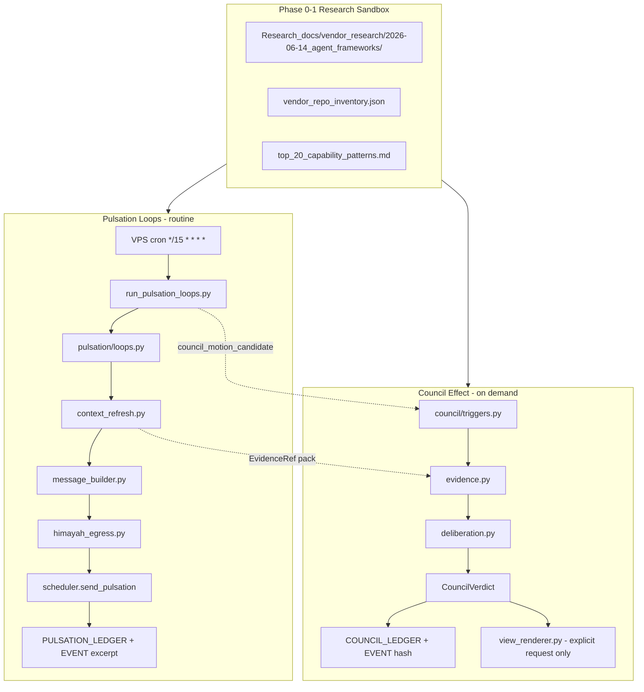
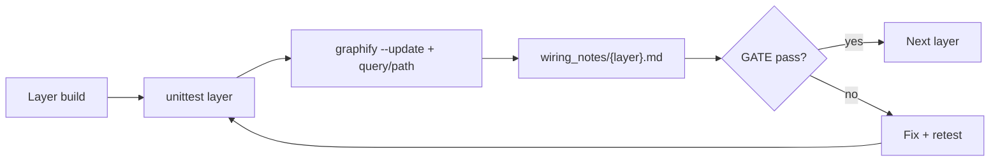
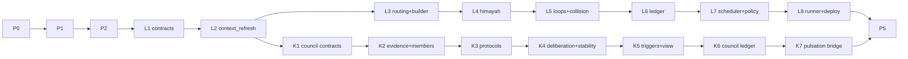

# NIZAM Proactive Pulsation Layer + Council Effect + Skills Expansion

**Prompt:** `NIZAM_HERMES_Pulsation_Council_Skills_Expansion_Plan` v1.0  
**Executor:** Codex IDE Agent / local developer agent  
**Mode:** granular_planning_then_safe_implementation  
**Privacy:** `private_ai_ok` for architecture; `strict_local` for all user data paths  
**First next action:** **Phase 0.1 → 0.6**, then **GATE-0** — then Phase 1.1 → 1.8, **GATE-1** — before any production code (Layer L1).

---

## Executive summary

| Track | Goal | Loop A impact |
|-------|------|---------------|
| **Pulsation** | Replace static hourly/Hermes pulses with context-first Loops A/B | Short companion check-ins only |
| **Council** | Separate evaluation subsystem under `companion/council/` | May emit `council_required`, `council_motion_candidate`, or `council_summary_hash` — **never full debate in routine pulses** |
| **Research** | Inspect 12 OSS agent repos; extract NIZAM-native patterns | Informs council, skills, guardrails — no blind installs |
| **Skills** | Capability packs + registry with gates and tests | Activated on explicit command or high-value triggers |

**User decisions (locked):** waking hours 07:00–22:30 Africa/Cairo; **disable Hermes 3×/day static pulses** after pulsation dry-run + live smoke tests pass.

### Wiring notes index

See [`docs/architecture/wiring_notes/`](D:/NIZAM/docs/architecture/wiring_notes/): `GATE-0_baseline.md`, `GATE-1_research_patterns.md`, `GATE-2_preflight_paths.md`, `L1_contracts.md` … `L8_runner.md`, `K1_council_contracts.md` … `K7_bridge.md`.

**Framework policy (INFERENCE):** Do not adopt LangGraph/CrewAI/AutoGen as dependencies for MVP. Extract patterns; implement in local Python modules. Revisit LangGraph or OpenAI Agents SDK only if native orchestration exceeds safe complexity.

---

## Current state (FACT)

Existing proactive plumbing in [`NIZAM__system/companion/`](D:/NIZAM/NIZAM__system/companion/) does **not** meet the pulsation spec:

- [`tools/run_proactive_scheduler.py`](D:/NIZAM/tools/run_proactive_scheduler.py) — static hourly Telegram (calendar titles only).
- [`companion/proactive.py`](D:/NIZAM/NIZAM__system/companion/proactive.py) — blocks on `sukoon_red` instead of tiny-mode downshift.
- [`companion/scheduler.py`](D:/NIZAM/NIZAM__system/companion/scheduler.py) — no `context_refresh`, no THABAT ledger append.
- VPS hourly cron via [`deploy_nizam_vps.py`](D:/NIZAM/tools/deploy_nizam_vps.py); Hermes 09:00/15:00/21:00 via [`setup_hermes_scheduled_telegram.py`](D:/NIZAM/tools/setup_hermes_scheduled_telegram.py).

**Council gap (MISSING):** No `companion/council/` package, no `COUNCIL_LEDGER`, no progressive deliberation or dissent preservation.

---

## Target architecture



**Architecture rule:** Loop A stays short. Full council debate appears only on explicit user request (`/council-review`, "show me the council debate") or high-value triggers (architecture change, conflicting signals, weekly review, major decision).

---

## Development support toolkit (graphify + review gates)

Every implementation layer follows **Build → Test → Graphify review → Gate**. Do not start the next layer until the gate passes.

### Tools per gate type

| Tool | When | Scope | Privacy |
|------|------|-------|---------|
| **graphify** (`/graphify`) | Baseline, after each layer, pre-deploy | `NIZAM__system/companion/` only for production; research sandbox separately | Never graphify YAWMIYAT, BADAN, SUKOON, ledgers, `.env` |
| **graphify query** | Wiring verification | e.g. `"How does context_refresh reach scheduler?"` | Query existing `graphify-out/graph.json` first — no rebuild if graph exists |
| **graphify path** | Cross-module trace | e.g. `path "context_refresh" "ledger_writer"` | Same scope rules |
| **graphify --update** | After adding files in a layer | Incremental rebuild on touched subfolder | `--no-viz` OK for CI-style checks |
| **verify-nizamcore.ps1** | GATE-2, GATE-3A, GATE-5 | Non-destructive repo health | Safe |
| **nizam_startup.py** | GATE-5, deploy smoke | Startup receipt | Safe |
| **unittest** | Every layer | Layer-specific test module | Use fixtures/tmp dirs for strict_local data |
| **Bugbot / code-reviewer** (optional) | After GATE-3A, GATE-3B | Branch diff review | Readonly |

### Graphify locations (FACT)

| Graph root | Output path | Purpose |
|------------|-------------|---------|
| `D:\NIZAM\NIZAM__system\companion\` | `D:\NIZAM\NIZAM__system\companion\graphify-out\` | Production pulsation + council wiring |
| `D:\NIZAM\Research_docs\vendor_research\2026-06-14_agent_frameworks\` | `.../graphify-out/` | Research pattern cross-links only |

**Commands (production companion scope):**
```powershell
# Baseline (Phase 0.6) — code + docs only, no strict-local folders
cd D:\NIZAM\NIZAM__system\companion
graphify . --no-viz

# After each layer (incremental)
graphify . --update --no-viz

# Wiring check (use existing graph)
graphify query "How does pulsation context_refresh connect to scheduler and ledger_writer?"
graphify path "context_refresh" "send_proactive"
```

### Inter-layer gate template

Each **GATE-*** block requires:

1. **Unit tests** — layer tests green (`unittest` exit 0).
2. **Graphify review** — run query/path; save 3–5 bullet wiring notes to `docs/architecture/wiring_notes/{layer_id}.md`.
3. **HIMAYAH spot-check** — no strict-local paths in graphify scan root; no journal bodies in test fixtures sent externally.
4. **Receipt** — append row to `implementation_status.json` with `layer`, `tests_passed`, `graphify_reviewed`, `gate_passed_at`.



---

## Master sequence (all sub-phases)

| Phase | Sub-phases | Gate |
|-------|------------|------|
| 0 | 0.1 → 0.6 | **GATE-0** |
| 1 | 1.1 → 1.8 | **GATE-1** |
| 2 | 2.1 → 2.8 | **GATE-2** |
| 3A | L1 → L8 | **GATE-3A** |
| 3B | K1 → K7 | **GATE-3B** |
| 4 | 4.1 → 4.6 | **GATE-4** |
| 5 | 5.1 → 5.5 | **GATE-5** |
| 6 | 6.1 → 6.6 | **GATE-6** (full matrix) |
| 7 | 7.1 → 7.4 | **GATE-7** (deliverables + THABAT) |

---

## Phase 0 — Privacy and safety gate (0.1–0.6)

**Objective:** Safe research boundaries + companion baseline graph before external code or production edits.

| ID | Task | Files | Est. | Test after | Acceptance |
|----|------|-------|------|------------|------------|
| **0.1** | Create research sandbox dirs | `Research_docs/vendor_research/2026-06-14_agent_frameworks/{repos,patterns,assessments}/` | 15m | `Test-Path` all dirs | Outside YAWMIYAT/BADAN/SUKOON/ledgers |
| **0.2** | Write RESEARCH_README | `RESEARCH_README.md` | 20m | Manual read | Read-only clones; no copy without approval; `git clone --depth 1` |
| **0.3** | Privacy scan script + report | `tools/privacy_scan_research.ps1`, `privacy_scan_report.md` | 30m | Script exit 0; report lists blocked paths | `.env`, ledgers, journals, tokens, OAuth blocked |
| **0.4** | Assessment JSON schema | `vendor_repo_assessment.schema.json` | 20m | Validate empty fixture JSON | Required fields per spec |
| **0.5** | Blocked-paths manifest | `blocked_paths.json` (gitignored pattern list) | 15m | Cross-check vs `PRIVACY_CLASSIFICATION.json` | Matches HIMAYAH rules |
| **0.6** | Graphify baseline on companion | `NIZAM__system/companion/graphify-out/` | 30m | `graph.json` exists; node count > 0 | Scope = companion/ only; `--no-viz` OK |

### GATE-0 (required before Phase 1)

| Check | Command / artifact |
|-------|-------------------|
| Privacy scan pass | `privacy_scan_report.md` status = PASS |
| Sandbox exists | `Research_docs/vendor_research/2026-06-14_agent_frameworks/RESEARCH_README.md` |
| Schema valid | JSON schema validates sample `{}` inventory row |
| Companion graph baseline | `NIZAM__system/companion/graphify-out/graph.json` |
| Wiring note | `docs/architecture/wiring_notes/GATE-0_baseline.md` — summarize existing companion modules (scheduler, proactive, contracts) |

**Safety rules (mandatory):**
- Shallow clone only; never run untrusted install/postinstall/Docker until reviewed.
- Never expose strict-local content to cloned repos, graphify, or external tools.
- HIMAYAH review before any network step that might transmit private context.
- License + dependency audit before any package adoption.

---

## Phase 1 — External repo research (1.1–1.8)

**Objective:** Inspect 12 candidate repos; convert findings to NIZAM-native pattern cards. **Blocked until GATE-0 passes.**

### Candidate repos

| Repo | URL | Integration stance |
|------|-----|-------------------|
| microsoft/autogen | github.com/microsoft/autogen | adapt_concepts_only |
| crewAIInc/crewAI | github.com/crewAIInc/crewAI | adapt_yaml_skill_patterns |
| langchain-ai/langgraph | github.com/langchain-ai/langgraph | state_machine_if_justified |
| run-llama/llama_index | github.com/run-llama/llama_index | adapt_context_refresh_RAG |
| agno-agi/agno | github.com/agno-agi/agno | adapt_docs_skill_org |
| openai/openai-agents-python | github.com/openai/openai-agents-python | high_priority_guardrails_handoffs |
| modelcontextprotocol/servers | github.com/modelcontextprotocol/servers | future_connectors_only |
| dair-ai/Prompt-Engineering-Guide | github.com/dair-ai/Prompt-Engineering-Guide | skill_design_principles |
| openai/openai-cookbook | github.com/openai/openai-cookbook | api_evals_reference |
| f/prompts.chat | github.com/f/prompts.chat | structure_only_no_unfiltered_import |
| camel-ai/camel | github.com/camel-ai/camel | conceptual_council_reference |
| microsoft/semantic-kernel | github.com/microsoft/semantic-kernel | adapt_skill_plugin_contracts |

### Scoring rubric (0–5 each)

`license_safety`, `stars_and_community`, `recent_activity`, `documentation_quality`, `security_posture`, `test_coverage_visibility`, `fit_local_first`, `fit_HIMAYAH`, `fit_SUKOON`, `fit_THABAT`, `implementation_complexity`, `reuse_value`

**Decision labels:** `adopt_dependency` | `adapt_pattern` | `read_only_reference` | `reject_for_now`

| ID | Task | Output | Est. | Test after |
|----|------|--------|------|------------|
| **1.1** | Empty inventory + validate schema | `vendor_repo_inventory.json` `{"repos":[]}` | 15m | JSON schema validate |
| **1.2** | Clone batch A (4 repos: autogen, crewAI, langgraph, llama_index) | `repos/*` shallow | 45m | Privacy scan on sandbox only |
| **1.3** | Assessments batch A | `assessments/{slug}.md` × 4 | 60m | Each has license + decision_label |
| **1.4** | Clone batch B (4 repos: agno, openai-agents, MCP servers, prompt guide) | `repos/*` | 45m | Privacy scan |
| **1.5** | Assessments batch B + update inventory | inventory JSON rows 5–8 | 60m | Schema validate |
| **1.6** | Clone batch C (4 repos: cookbook, prompts.chat, camel, semantic-kernel) | `repos/*` | 45m | Privacy scan |
| **1.7** | Assessments batch C + pattern cards | `patterns/*.md`, inventory complete (12 rows) | 90m | `ranking_table.md`, `rejected_patterns.md` |
| **1.8** | Synthesize + research graphify | `top_20_capability_patterns.md`; `graphify-out/` on sandbox `--no-viz` | 45m | graphify query: "orchestration patterns for multi-agent council" |

### GATE-1 (required before Phase 2 / production code)

| Check | Artifact |
|-------|----------|
| Inventory complete | `vendor_repo_inventory.json` — 12 repos, all validate |
| Top patterns | `top_20_capability_patterns.md` — each mapped to NIZAM module or rejected |
| Rejections documented | `rejected_patterns.md` |
| No production copy | Grep: zero third-party `.py` under `NIZAM__system/` from research |
| Wiring note | `wiring_notes/GATE-1_research_patterns.md` — which patterns feed L/K layers |

**Hard reject:** unclear license, strict-local egress, arbitrary code execution, invasive cloud MVP, breaks local-first, debate theater, dependency bloat.

---

## Phase 2 — Pre-flight and sequencing (2.1–2.8)

**Objective:** Atomic tasks, dependency map, rollback, observability. **Blocked until GATE-1 passes.**

| ID | Task | Output | Est. | Test after |
|----|------|--------|------|------------|
| **2.1** | Pre-flight read companion/ | `preflight_inspection_notes.md` § companion | 30m | Notes cite scheduler.py, proactive.py, contracts.py line refs |
| **2.2** | Pre-flight read relay/ + governor/ | same doc § relay, governor | 30m | Notes cite sukoon_gate, ledger_writer, classifier |
| **2.3** | Pre-flight read tools/ + tests/ | same doc § tools, tests | 20m | Notes cite run_proactive_scheduler, test_companion |
| **2.4** | Graphify wiring map (existing code) | `wiring_notes/GATE-2_preflight_paths.md` | 30m | `graphify path "scheduler" "poller"` + `path "ledger_writer" "EVENT_LEDGER"` |
| **2.5** | Dependency map JSON | `docs/architecture/dependency_graph.json` | 30m | Valid JSON; edges L1→L8, K1→K7 |
| **2.6** | Rollback plan | `docs/architecture/rollback_plan.md` | 20m | Restore steps per layer |
| **2.7** | Dry-run receipt schema + stub | `pulsation/receipt.schema.json`, runner stub returns fixture | 30m | Schema validates sample receipt |
| **2.8** | Implementation status tracker init | `docs/architecture/implementation_status.json` | 15m | Schema with layer/gate fields |

### GATE-2 (required before Phase 3A Layer L1)

| Check | Command |
|-------|---------|
| Preflight complete | `preflight_inspection_notes.md` all 4 sections |
| Graphify paths documented | `GATE-2_preflight_paths.md` — companion→relay→governor trace |
| verify-nizamcore | `D:\NIZAM\scripts\verify-nizamcore.ps1` exit 0 |
| nizam_startup receipt | `tools/nizam_startup.py` exit 0 |
| Dependency graph | `dependency_graph.json` lists L1–L8 order |

### Dependency graph (implementation order)



### Rollback points

| After | Rollback action |
|-------|-----------------|
| L1 Contracts/schema | Revert contracts.py; delete schema |
| L2 context_refresh | Remove `pulsation/context_refresh.py` |
| L8 Runner | Restore hourly cron; re-enable Hermes pulses |
| L6 Ledger | Remove PULSATION_LEDGER from KNOWN_LEDGERS |
| K6 Council ledger | Remove COUNCIL_LEDGER from KNOWN_LEDGERS |

### Dry-run receipt schema

```json
{
  "run_at": "ISO-8601",
  "dry_run": true,
  "loop_evaluated": "a|b|all",
  "loop_sent": null,
  "agent_chosen": "Salman",
  "context_refresh": {},
  "council_required": false,
  "council_motion_candidate": null,
  "privacy_result": "pass",
  "sukoon_result": "green|yellow|red|crisis_suppress",
  "send_status": "skipped_dry_run",
  "ledger_status": "skipped_dry_run",
  "skipped_reasons": [],
  "graphify_layer_reviewed": "L8"
}
```

---

## Phase 3A — Pulsation core (Layers L1–L8)

**Privacy:** strict_local reads; Telegram egress `public_safe` only after HIMAYAH.  
**Rule:** Complete **L{n} → test → graphify --update → wiring note → mini-gate** before L{n+1}.

Package root: [`NIZAM__system/companion/pulsation/`](D:/NIZAM/NIZAM__system/companion/pulsation/)

### Layer L1 — Contracts + schema (~45 min)

| Step | Work | Files |
|------|------|-------|
| L1.1 | `ContextRefresh`, `PulsationMessage` dataclasses + council metadata fields | `contracts.py` |
| L1.2 | JSON Schema | `schemas/pulsation_message.schema.json` |
| L1.3 | Test: `test_pulsation_contracts.py` — import, schema validate fixture | `tests/` |
| L1.4 | Graphify `--update`; query: "What imports contracts in companion?" | `wiring_notes/L1_contracts.md` |

**Mini-gate L1:** unittest green; schema validates; graphify note saved.

### Layer L2 — context_refresh.py (~90 min)

| Source key | Path | Fresh window | Safe signal |
|------------|------|--------------|-------------|
| yawmiyat_journal | `YAWMIYAT__journaling/sessions/`, `entries/` | 72h | date only |
| witness_reflection | same sessions | 72h | session_type, capacity |
| pulse_entries | `~/.hermes/nizam/last_pulse.json` | 48h | recovery band |
| whoop_badan | `BADAN__body_health_system/daily_signals/whoop-*.jsonl` | 48h | objective metrics |
| sukoon_capacity | `sukoon_gate.py`, `SUKOON__recovery_first/signals/` | 24h | green/yellow/red |
| open_loops | session `open_questions[]` | 7d | count only |
| active_decisions | `DECISION_LEDGER` tail + session `decisions[]` | 7d | count + date |
| thabat_summary | last 5 `EVENT_LEDGER` rows | 24h | action types + ts |
| recent_interactions | `runtime_events.py` | 24h | count + last ts |

| Step | Work | Test |
|------|------|------|
| L2.1 | Implement scanners (read-only) | `test_context_refresh_no_fabrication` |
| L2.2 | Confidence rules (high/medium/low) | `test_context_refresh_confidence` |
| L2.3 | Fixtures with tmp dirs (no real journals in CI) | `test_context_refresh_missing_sources` |
| L2.4 | Graphify path: `context_refresh` → source modules | `wiring_notes/L2_context_refresh.md` |

**Mini-gate L2:** no journal body in refresh output objects; tests green.

### Layer L3 — routing + message_builder (~60 min)

| Step | Work | Test |
|------|------|------|
| L3.1 | `routing.py` — Salman/Hayat/Sadiq selection | `test_routing_by_freshest_source` |
| L3.2 | `message_builder.py` — rule-based templates | `test_message_format_companion` |
| L3.3 | Integration: refresh → route → build | `test_build_from_refresh_fixture` |
| L3.4 | Graphify query: "flow from context_refresh to message_builder" | `wiring_notes/L3_routing_builder.md` |

**Mini-gate L3:** message starts with identity line; one focus_trigger.

### Layer L4 — himayah_egress.py (~45 min)

| Step | Work | Test |
|------|------|------|
| L4.1 | Redact journal bodies; set privacy_level | `test_himayah_redacts_journal` |
| L4.2 | Refuse raw strict_local egress | `test_himayah_blocks_raw_egress` |
| L4.3 | Wire builder → himayah → safe message | `test_himayah_pipeline` |
| L4.4 | Graphify path: `himayah_egress` → `classifier` | `wiring_notes/L4_himayah.md` |

**Mini-gate L4:** HIMAYAH tests green; Ammar silent (no voice in message).

### Layer L5 — loops + collision + state (~60 min)

| Step | Work | Test |
|------|------|------|
| L5.1 | `loops.py` — 3h/2h cadence, waking hours | `test_waking_hours` |
| L5.2 | `collision.py` — A wins ±20 min | `test_collision_loop_a_wins` |
| L5.3 | `pulsation-state.json` persistence | `test_state_persistence` |
| L5.4 | Loop B disabled placeholder | `test_islamic_loop_disabled` |
| L5.5 | Graphify: loops orchestration edges | `wiring_notes/L5_loops.md` |

**Mini-gate L5:** collision + waking hours tests green.

### Layer L6 — Ledger (~45 min)

| Step | Work | Test |
|------|------|------|
| L6.1 | Register `PULSATION_LEDGER` | `ledger_writer`, `init_ledgers`, `NIZAM_TEMPLE.json` |
| L6.2 | `pulsation/ledger.py` — dual append | `test_ledger_append` (mock writer) |
| L6.3 | Dry-run: ledger_status = skipped | receipt test |
| L6.4 | Graphify path: `ledger` → `ledger_writer` | `wiring_notes/L6_ledger.md` |

**Mini-gate L6:** EVENT excerpt ≤400 chars; no raw journal in payload.

### Layer L7 — scheduler + proactive policy (~60 min)

| Step | Work | Test |
|------|------|------|
| L7.1 | `scheduler.send_pulsation()` | extend `test_production_modules` |
| L7.2 | `proactive.py` tiny-mode vs crisis suppress | `test_sukoon_tiny_mode` |
| L7.3 | Map PulsationMessage → ProactiveCandidate | `test_candidate_mapping` |
| L7.4 | Graphify path: `send_pulsation` → `poller.tg_send_message` | `wiring_notes/L7_scheduler.md` |

**Mini-gate L7:** existing companion tests still pass (`test_companion.py`).

### Layer L8 — Runner + deploy wiring (~60 min)

| Step | Work | Test |
|------|------|------|
| L8.1 | `run_pulsation_loops.py` — dry-run receipt | CLI integration test |
| L8.2 | `run_proactive_scheduler.py` wrapper | backward compat test |
| L8.3 | `deploy_nizam_vps.py` cron `*/15` | audit script expectation |
| L8.4 | `setup_hermes_scheduled_telegram.py --remove` (after smoke only) | manual checklist |
| L8.5 | Graphify full pulsation subgraph review | `wiring_notes/L8_runner.md` |

### GATE-3A (required before Phase 3B K1)

```powershell
D:\NIZAM\.venv\Scripts\python.exe -m unittest NIZAM__system.companion.tests.test_pulsation -v
D:\NIZAM\.venv\Scripts\python.exe D:\NIZAM\tools\run_pulsation_loops.py --dry-run --at 2026-06-14T10:00:00+00:00
cd D:\NIZAM\NIZAM__system\companion && graphify query "Trace pulsation from run_pulsation_loops to ledger_writer"
```

| Check | Required |
|-------|----------|
| All L1–L8 wiring notes exist | `wiring_notes/L1_*.md` … `L8_*.md` |
| test_pulsation full suite | exit 0 |
| Dry-run receipt | valid JSON per schema |
| graphify review | query answer matches implemented modules |
| Optional | Bugbot readonly on diff |

---

## Phase 3B — Council Effect (Layers K1–K7)

**Objective:** Typed evaluation layer — **not** embedded in every check-in.  
**Location:** [`NIZAM__system/companion/council/`](D:/NIZAM/NIZAM__system/companion/council/)  
**Rule:** Same **build → test → graphify → mini-gate** per layer. **Blocked until GATE-3A passes.**

### Layer K1 — Council contracts + schemas (~45 min)

| Step | Work | Test |
|------|------|------|
| K1.1 | `CouncilMotion`, `EvidenceRef`, `AgentPosition`, `Vote`, `CouncilVerdict`, `CouncilView` | `test_council_contracts.py` |
| K1.2 | Schemas: `council_motion`, `council_verdict`, `council_view` | schema validate |
| K1.3 | Graphify `--update` on `companion/council/` | `wiring_notes/K1_council_contracts.md` |

### Layer K2 — evidence + members (~60 min)

| Step | Work | Test |
|------|------|------|
| K2.1 | `evidence.py` from `ContextRefresh` — no journal bodies | `test_evidence_no_journal_egress` |
| K2.2 | `members.py` — Salman, Hazim, Khaldun, Hayat, Sadiq, Khalid, Ammar, Yusra | `test_member_veto_rights` |
| K2.3 | Graphify path: `evidence` → `context_refresh` | `wiring_notes/K2_evidence_members.md` |

### Layer K3 — decision_protocols (~45 min)

| Step | Work | Test |
|------|------|------|
| K3.1 | majority, supermajority, weighted, unanimity, judge synthesis, veto, defer | `test_protocol_tie_abstain_veto` |
| K3.2 | Low-confidence → defer | `test_protocol_low_confidence` |
| K3.3 | Graphify query: "decision protocol flow" | `wiring_notes/K3_protocols.md` |

### Layer K4 — deliberation + stability (~60 min)

| Step | Work | Test |
|------|------|------|
| K4.1 | Progressive flow: 2 positions → rebuttal → full council | `test_progressive_deliberation` |
| K4.2 | `stability.py` adaptive stop (2 stable rounds / max_rounds) | `test_adaptive_stop` |
| K4.3 | Dissent preserved in verdict | `test_dissent_preservation` |
| K4.4 | Graphify: deliberation state machine edges | `wiring_notes/K4_deliberation.md` |

### Layer K5 — triggers + view_renderer (~60 min)

| Step | Work | Test |
|------|------|------|
| K5.1 | `triggers.py` — no council on routine check-in | `test_triggers_routine_pulse_skips_council` |
| K5.2 | HIMAYAH veto + SUKOON downshift pre-verdict | `test_ammar_veto`, `test_yusra_red_blocks_heavy` |
| K5.3 | `view_renderer.py` — Markdown, HTML, Telegram compact + vote table | `test_view_telegram_safe` |
| K5.4 | Graphify: triggers → pulsation metadata fields | `wiring_notes/K5_triggers_view.md` |

### Layer K6 — COUNCIL_LEDGER (~45 min)

| Step | Work | Test |
|------|------|------|
| K6.1 | Register `COUNCIL_LEDGER` in ledger_writer + init + TEMPLE | bootstrap test |
| K6.2 | `council/ledger.py` — full strict_local + EVENT hash excerpt | `test_council_ledger_append` |
| K6.3 | Graphify path: `council/ledger` → `ledger_writer` | `wiring_notes/K6_council_ledger.md` |

### Layer K7 — Pulsation bridge (~45 min)

| Step | Work | Test |
|------|------|------|
| K7.1 | Wire `council_required`, `council_motion_candidate`, `council_summary_hash` on `PulsationMessage` | `test_pulsation_council_metadata` |
| K7.2 | Loop A emits hash only — never full debate | `test_loop_a_no_debate_text` |
| K7.3 | `/council-review` command stub in relay or skill router | manual dry-run |
| K7.4 | Graphify path: `pulsation` → `council/triggers` | `wiring_notes/K7_bridge.md` |

### GATE-3B (required before Phase 4)

```powershell
D:\NIZAM\.venv\Scripts\python.exe -m unittest NIZAM__system.companion.tests.test_council -v
cd D:\NIZAM\NIZAM__system\companion && graphify path "context_refresh" "CouncilVerdict"
```

| Check | Required |
|-------|----------|
| K1–K7 wiring notes | all present |
| test_council | exit 0 |
| No journal in evidence/view/telegram compact | egress tests |
| graphify cross-layer path | pulsation ↔ council documented |

### Council module map

| Module | Responsibility |
|--------|----------------|
| `contracts.py` | CouncilMotion, EvidenceRef, AgentPosition, Vote, CouncilVerdict, CouncilView |
| `members.py` | Registry: role, weight, veto, speaking rights |
| `evidence.py` | Pack from ContextRefresh + ledger summaries |
| `deliberation.py` | Progressive flow |
| `decision_protocols.py` | Vote aggregation + defer |
| `stability.py` | Adaptive stop |
| `triggers.py` | When council may run |
| `view_renderer.py` | Vote table + dissent memo |
| `ledger.py` | COUNCIL_LEDGER + EVENT hash |

---

## Phase 4 — Skills library (4.1–4.6)

**Blocked until GATE-3B passes.**

| ID | Task | Output | Test after |
|----|------|--------|------------|
| **4.1** | Skills registry metadata schema | `skills_registry/registry.schema.json` + index | schema validate |
| **4.2** | Capability packs (9) — spec + JSON schema each | `skills/*.skill.md` | rubric score ≥3/5 each |
| **4.3** | Prompt quality rubric | `docs/architecture/prompt_quality_rubric.md` | score sample skill |
| **4.4** | Curated prompt ingestion script (license-aware) | `tools/ingest_curated_prompts.py` | no unlicensed copy test |
| **4.5** | Skill tests ≥3 fixtures each | `tests/test_skills_registry.py` | happy / missing / privacy |
| **4.6** | Activation router | `skills_registry/router.py` | `/council-review` maps correctly |

### GATE-4

```powershell
D:\NIZAM\.venv\Scripts\python.exe -m unittest NIZAM__system.companion.tests.test_skills_registry -v
graphify query "How do skills connect to companion pulsation and council?"
```

---

## Phase 5 — HERMES / NIZAM integration (5.1–5.5)

**Blocked until GATE-4 passes.**

| ID | Task | Test / review after |
|----|------|---------------------|
| **5.1** | Council metadata on pulsation dry-run receipt | receipt schema test |
| **5.2** | Trigger rules — routine check-in skips full council | `test_triggers_routine_pulse_skips_council` |
| **5.3** | Hermes bridge: Telegram-safe text + ledger hashes | dry-run + optional live smoke (operator approval) |
| **5.4** | POP_HEALTH report stub from council + research | schema validate report JSON |
| **5.5** | Disable Hermes static pulses **only after** 5.3 smoke pass | `audit_vps_wiring.py` — no Hermes pulse cron |

### Council trigger rules (default)

| Trigger | council_required | Full debate |
|---------|------------------|-------------|
| Routine Loop A check-in | false | never |
| Conflicting fresh signals | true | on user request |
| Weekly review window | motion_candidate | on user request |
| Architecture / major decision | true | on user request |
| Explicit `/council-review` | true | yes |

### GATE-5 (pre-deploy)

```powershell
D:\NIZAM\.venv\Scripts\python.exe -m unittest discover -s NIZAM__system/companion/tests -v
D:\NIZAM\.venv\Scripts\python.exe D:\NIZAM\tools\run_pulsation_loops.py --dry-run --at 2026-06-14T10:00:00+00:00
D:\NIZAM\scripts\verify-nizamcore.ps1
D:\NIZAM\.venv\Scripts\python.exe D:\NIZAM\tools\nizam_startup.py
D:\NIZAM\.venv\Scripts\python.exe D:\NIZAM\tools\audit_vps_wiring.py
graphify . --update --no-viz
graphify query "End-to-end path from cron to Telegram to ledger for pulsation"
```

Optional: Bugbot readonly review on full diff before VPS deploy.

---

## Phase 6 — Full test matrix (6.1–6.6)

| ID | Suite | Covers | Gate |
|----|-------|--------|------|
| **6.1** | `test_pulsation.py` (atomic) | L1–L8 behaviors per layer | per-layer mini-gates |
| **6.2** | `test_council.py` | K1–K7 behaviors | per-layer mini-gates |
| **6.3** | `test_skills_registry.py` | 4.x | GATE-4 |
| **6.4** | Integration dry-run | deterministic receipt; no external sends | GATE-5 |
| **6.5** | Quality fixtures | single-agent vs council vs vote-only | council value proof |
| **6.6** | Regression | `test_companion.py`, `test_production_modules.py` still pass | GATE-5 |

### Test matrix (layer → test file mapping)

| Layer | Primary tests |
|-------|---------------|
| L1 | `test_pulsation_contracts` |
| L2 | `test_context_refresh_*` |
| L3 | `test_routing_*`, `test_message_format_*` |
| L4 | `test_himayah_*` |
| L5 | `test_collision_*`, `test_waking_hours`, `test_islamic_loop_disabled` |
| L6 | `test_ledger_append` |
| L7 | `test_sukoon_tiny_mode`, `test_candidate_mapping` |
| L8 | CLI dry-run integration |
| K1–K7 | `test_council.py` modules per layer |
| 4.x | `test_skills_registry.py` |

### GATE-6

All Phase 6 suites green + wiring_notes complete for L1–L8, K1–K7, GATE-0 through GATE-5.

---

## Phase 7 — Deliverables (7.1–7.4)

**Blocked until GATE-6 passes.**

| ID | Artifact | Path | Acceptance |
|----|----------|------|------------|
| **7.1** | Expanded plan (repo copy) | [`docs/architecture/NIZAM_Pulsation_Council_Expanded_Plan.md`](D:/NIZAM/docs/architecture/NIZAM_Pulsation_Council_Expanded_Plan.md) | Mirrors this plan + wiring_notes index |
| **7.2** | Gap report HTML | [`docs/architecture/NIZAM_Repo_Research_Skills_Gap_Report.html`](D:/NIZAM/docs/architecture/NIZAM_Repo_Research_Skills_Gap_Report.html) | Repo ranking, patterns, gaps, adoption decisions |
| **7.3** | Implementation status | [`docs/architecture/implementation_status.json`](D:/NIZAM/docs/architecture/implementation_status.json) | All gates with pass timestamps |
| **7.4** | THABAT closeout + final graphify | EVENT_LEDGER append; `graphify . --update`; `GRAPH_REPORT.md` excerpt in 7.2 | facts, decisions, actions, open loops, privacy, recovery, confidence, next step |

### GATE-7 (project complete)

| Check | Required |
|-------|----------|
| All GATE-0 … GATE-6 passed | `implementation_status.json` |
| wiring_notes/ complete | L1–L8, K1–K7, GATE-0 … GATE-5 |
| HTML gap report renders | browser open smoke |
| THABAT closeout | EVENT_LEDGER row + log.md line |
| Final graphify | companion `graphify-out/GRAPH_REPORT.md` — god nodes + surprising connections summarized in 7.2 |

---

## Implementation constraints (invariants)

- Local-first; recovery-first (SUKOON).
- No diagnosis or clinical claims in proactive/council output.
- No raw journal text in Telegram, council views, reports, or EVENT_LEDGER.
- No autonomous Islamic reminder content until config + source validation.
- No external repo code in production without license/security/dependency review.
- No production dependency adds without proven capability gain.
- Council: progressive, evidence-backed, measurable — not permanent agent theater.
- Every major output: machine-readable status + THABAT closeout.

---

## Pulsation message schema (reference)

Loop A `PulsationMessage` includes:

```python
@dataclass(frozen=True)
class PulsationMessage:
    message_type: Literal["companion_checkin", "islamic_reminder"]
    agent_name: str
    agent_role: str
    generated_at: str
    context_refresh: ContextRefresh
    message: str
    focus_trigger: str
    requires_user_reply: bool = False
    council_required: bool = False
    council_motion_candidate: str | None = None
    council_summary_hash: str | None = None
```

---

## Out of scope (explicit)

- LLM message phrasing for Loop A (until grounding guardrails proven).
- Inbound relay poller changes.
- Unfiltered import from prompts.chat or generic prompt libraries.
- Full council debate in routine 3-hour check-ins.
- Notion MCP integration for this track (unless operator requests separately).

---

## Uncertainty register

| Item | Status |
|------|--------|
| Exact SUKOON yellow vs red thresholds for council veto | ASSUMPTION — align with existing overload_flags + capacity bands |
| VPS has strict-local data paths synced locally | INFERENCE — deploy sync excludes journals; context_refresh may often return low confidence on VPS |
| LangGraph adoption | MISSING decision — defer until Phase 1 ranking complete |
| YAWMIYAT.json / SUKOON.json persona files pending | FACT — use agent_personas.json codenames |
