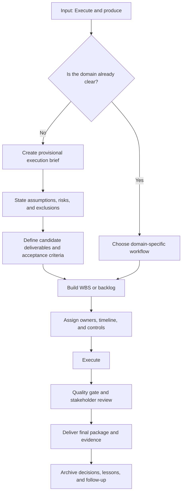
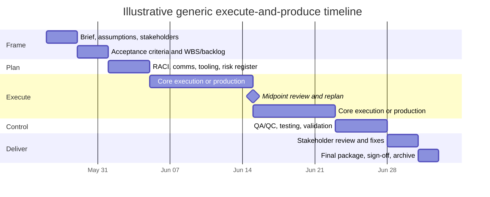

# Executing and Producing When Intent Is Unspecified

## Executive summary

The instruction **“execute and produce”** is not a complete scope statement. Across delivery disciplines, it consistently implies two obligations: **perform the necessary work** and **generate a concrete, reviewable artifact or outcome**. What changes by context is the form of the artifact, the governing controls, and the proof required for acceptance. In software, that proof is typically a working increment that meets a Definition of Done; in research, it is a protocol, data, analysis, and reproducible outputs; in manufacturing, it is validated production with quality records; in events, it is a safely executed event with specifications and post-event reporting; and in compliance/legal work, it is an implemented control or legal artifact with evidence, training, approvals, and auditability. citeturn11view6turn10view4turn13view0turn31view0turn31view1turn18view0turn18view3

Because the user’s intent is unspecified, the highest-confidence default is **not** to begin domain-specific production blindly. The best default is to create a **provisional execution package** that converts ambiguity into an executable mandate: objective statement, stakeholder map, assumptions log, acceptance criteria, work breakdown structure or backlog, timeline, roles, communications cadence, risks, quality gates, and delivery package. That approach is strongly aligned with NASA’s emphasis on defining stakeholder expectations and technical planning, GAO’s guidance on WBS and reliable schedules, Scrum’s focus on Sprint Planning, stakeholder review, and Definition of Done, FDA’s lifecycle validation discipline, and DOJ’s focus on risk assessment, controls, communication, and periodic testing. citeturn25view3turn25view2turn22view0turn24view0turn11view5turn11view4turn11view6turn13view3turn18view0turn18view3

The practical recommendation is therefore this: **when asked only to “execute and produce,” assume the first deliverable should be an execution brief and delivery plan unless the domain and output are already obvious from context.** After that, move into domain-specific execution with explicit quality and acceptance gates. The rest of this report provides a rigorous cross-context model, execution plans, estimation methods, templates, governance examples, and recommended tools to do exactly that. citeturn25view3turn22view0turn24view1turn17view0turn17view1turn18view4

## Framing the instruction

At minimum, **“execute and produce”** should be parsed into three layers. First, **execute** means doing work against a plan, not merely proposing ideas. Second, **produce** means creating a tangible output. Third, in professional settings, a produced output usually must also be **provable**: it must satisfy stated requirements, be reviewable by stakeholders, and be supported by the right operational or compliance evidence. Scrum formalizes this with an Increment and Definition of Done; NIH requires planning and compliance for data management and sharing; FDA requires process validation, documentation, and continued verification; EIC event practice formalizes event specifications and post-event reporting; and DOJ evaluates whether compliance programs are well designed, operationalized, and periodically tested. citeturn11view6turn10view4turn13view0turn13view2turn31view0turn31view1turn18view0turn18view3

When the domain is not known, the correct first move is to transform the vague instruction into an **assumption-managed delivery model** rather than a fully committed build. NASA’s stakeholder expectation process explicitly starts with identifying stakeholders, eliciting expectations, baselining them, and obtaining stakeholder commitments; GAO’s cost guide emphasizes the WBS as the basis for identifying resources and tasks; and GAO’s schedule guide stresses that reliable delivery depends on a valid critical path and explicit risk analysis rather than arbitrary optimism. citeturn25view3turn22view0turn24view1turn24view2

This workflow is a synthesis of the planning, stakeholder, quality, and review disciplines found in NASA systems engineering, Scrum, FDA lifecycle validation, FEMA/EIC event practice, and DOJ compliance evaluation. citeturn25view3turn25view2turn11view5turn11view4turn13view3turn17view0turn31view1turn18view0turn28view0

## Interpretations across contexts

| Context | Primary objective | Typical deliverables | Typical stakeholders | Success metrics | Typical timeline | Illustrative resource band | Major risks | Core mitigations |
|---|---|---|---|---|---|---|---|---|
| Software development | Ship a working software change safely and predictably | Backlog, code, tests, build/release artifact, docs, release notes | Sponsor, product owner, developers, QA, security, operations, end users | Change lead time, deployment frequency, failed deployment recovery time, change fail rate, deployment rework rate, defect escape rate | Small increment: 2–6 weeks; product/project: 2–12 months | Small 2–5; medium 5–10; large 10–25+ | Scope creep, weak requirements, security debt, integration failure | Threat modeling, secure SDLC, backlog discipline, CI/CD, review gates, shared Definition of Done |
| Research project | Generate defensible, reproducible knowledge and compliant data outputs | Protocol, approvals, DMS plan, dataset, code, interim milestones, manuscript/report | PI, co-authors, funder, IRB/ethics, data manager, statistician, institution | Milestone attainment, data completeness, reproducibility, protocol adherence, submission/publication readiness | Small study: 1–3 months; medium: 3–9 months; large: 9–18+ months | Small 1–3; medium 4–8; large 8–20+ | Ethical/compliance delays, data loss, poor documentation, irreproducibility | Milestone gates, DMS planning, secure capture, versioned workspace, formal misconduct procedures, archive discipline |
| Creative production | Deliver an approved creative asset or campaign ready for use | Brief, script/storyboard, source assets, edit/design files, review versions, final masters, usage specs | Client, creative director, producer, editor/designer, brand, legal, channel owner | Approval cycle time, review rounds, rework rate, on-time publish, asset readiness | Small asset: days to 2 weeks; campaign: 3–12+ weeks | Small 2–6; medium 6–15; large 15–40+ | Feedback churn, version confusion, unclear brief, rights/brand issues | Locked brief, review SLAs, centralized review/approval, metadata/version control, explicit final master criteria |
| Manufacturing | Deliver a conforming physical product through a repeatable process | Process flow, qualification plan, validated process, QA records, production lots, deviation logs, release pack | Operations, engineering, quality, supply chain, maintenance, regulatory, suppliers | Yield, scrap/rework, deviations, schedule adherence, control state, equipment effectiveness | Pilot/line change: 4–12 weeks; scaled program: 3–12+ months | Small 5–15; medium 15–50; large 50+ plus equipment/vendor dependencies | Process variation, supplier delays, nonconformance, safety incidents | Integrated cross-functional validation, staged qualification, continued verification, hazard controls, structured issue resolution |
| Event execution | Run a safe, on-plan, on-message event and capture learning | ESG/spec pack, contracts/RFPs, registration site, run-of-show, risk/incident plan, attendee comms, post-event report | Organizer, venue, vendors, sponsors, speakers, security/public safety, attendees | Attendance, budget variance, satisfaction/feedback, incident rate, sponsor outcomes, on-time program | Small event: 2–6 weeks; medium: 6–16 weeks; major event: 4–6+ months | Small 3–8; medium 8–25; large 25–100+ with external vendors | Crowd/weather/safety risks, vendor failure, comms breakdown, registration and logistics issues | Hazard analysis, contingency planning, accepted-practice specs, role-based communications, structured post-event reporting |
| Legal/compliance tasks | Implement or document a legally defensible control, contract, or compliance outcome | Policy set, contract/redlines, control matrix, approvals, training records, investigation files, evidence pack | GC, compliance, privacy, IT, business owners, audit, board, external counsel | Control test pass rate, training completion, cycle time, issue aging, audit findings, evidence completeness | Targeted task: 1–4 weeks; program rollout: 1–6+ months | Small 2–5; medium 5–12; large 12–30+ | Stale policies, weak adoption, poor evidence, over-permissioned access, incomplete remediation | Risk assessment, tailored communications and training, periodic testing, least-privilege role design, searchable repository, structured routing |

This table is a synthesized planning model derived from official and primary sources across each domain: NIST SSDF, Scrum Guide, and DORA for software; NIH, ORI, 42 CFR Part 93, OSF, and REDCap for research; Adobe and Frame.io for creative workflows; FDA, NIST MEP, OSHA/NIOSH, and SAP for manufacturing; FEMA, DOJ special-event security guidance, EIC accepted practices, APEX templates, Event Safety Alliance, and Cvent for events; and DOJ ECCP, U.S. Sentencing Commission Chapter 8, Microsoft Purview, and Ironclad for legal/compliance work. Resource bands are **illustrative planning heuristics**, not published benchmarks. citeturn26view0turn26view1turn26view2turn26view3turn12view1turn10view4turn14view1turn14view5turn19view0turn19view1turn15view0turn15view2turn26view9turn26view10turn26view11turn16view0turn16view1turn10view10turn17view3turn17view2turn17view1turn31view0turn31view1turn20view5turn26view12turn26view13turn18view4turn29view0turn21view0

The important analytical point is that the phrase means the same **structurally** in every domain—plan, perform, verify, deliver—but not the same **operationally**. The highest variance lies in the control model: software emphasizes iteration and deployment stability, research emphasizes reproducibility and ethics, manufacturing emphasizes process capability and release control, events emphasize logistics and safety, and compliance/legal work emphasizes risk assessment, communication, evidence, and periodic testing. citeturn12view1turn10view4turn19view0turn13view0turn17view1turn26view12turn26view13

## Execution architecture and templates

### Universal execution plan

A robust default plan for “execute and produce” has seven steps.

First, define the mandate: desired outcome, stakeholder, due date, constraints, assumptions, and explicit exclusions. NASA treats stakeholder expectations and their validation as foundational, not optional, and GAO ties reliable cost and resource planning to a clear WBS. citeturn25view3turn22view0

Second, define **what “done” means**. In Scrum, work is not part of the Increment unless it meets the Definition of Done; in FDA-regulated manufacturing, successful completion requires lifecycle-based validation and documented control; in DOJ compliance evaluation, the question is whether the program is well designed, operationalized, and works in practice. citeturn11view6turn13view0turn13view2turn18view0turn18view2

Third, convert scope into executable units: WBS, backlog, function schedule, protocol steps, or control workstreams. GAO’s WBS guidance, Scrum’s Sprint Planning, and the APEX ESG structure all support this decomposition logic. citeturn22view0turn11view5turn31view0

Fourth, assign ownership, access, and communications. NASA technical planning explicitly identifies team roles, responsibilities, tools, and resources; DOJ emphasizes assignments of responsibility, lines of reporting and communication, and tailored training; Microsoft Purview formalizes role groups and least-privilege access. citeturn25view2turn28view2turn28view0turn29view0

Fifth, execute with cadence and evidence. Use short feedback loops, midpoint reviews, issue logs, and versioned records. Scrum formalizes daily adaptation and Sprint Review; Frame.io centralizes review/approval; FDA and DOJ both stress documentation, review, and continued verification or testing. citeturn26view2turn15view2turn13view2turn26view13

Sixth, apply a formal quality gate: test, peer review, validation, safety check, or compliance review depending on domain. GAO argues that reliable delivery depends on a valid critical path and explicit schedule risk analysis; FDA requires Stage 2 qualification and Stage 3 continued verification; Event Safety Alliance standards focus on communication, weather, crowd, security, and structural risk depending on event type. citeturn24view1turn24view2turn26view11turn13view2turn17view1

Seventh, deliver, obtain sign-off, and archive the learning. EIC’s Post-Event Report template explicitly treats post-event reporting as a reusable history artifact, while DOJ expects compliance programs to evolve through lessons learned and periodic review. citeturn31view1turn26view13

This Gantt is illustrative rather than prescriptive. Its structure follows the common sequencing logic visible in NASA technical planning, Scrum’s planning-review cycle, GAO’s WBS/schedule guidance, FDA lifecycle validation, and EIC/FEMA event specification and reporting practice. citeturn25view2turn11view5turn11view4turn22view0turn24view1turn24view2turn13view0turn31view0turn31view1

### Context-specific phase variants

| Context | Recommended phase sequence | Where calendar time usually expands | Minimum release/acceptance gate |
|---|---|---|---|
| Software | discovery → backlog/spec → sprinted build → testing/security → release | integration, review, dependency waiting | Definition of Done, test pass, release approval |
| Research | protocol → approvals/data plan → data collection → analysis → manuscript/report | ethics/IRB, participant/data collection, review cycles | protocol adherence, data quality, reproducibility check |
| Creative | brief → pre-production → production → post-production → approval → publish/handoff | feedback rounds, asset collection, brand/legal review | approved master files and usage-ready package |
| Manufacturing | process design → qualification → controlled production → continued verification → release | equipment/supplier readiness, qualification, deviations | qualified process, QC disposition, release records |
| Event | concept/specification → contracting/logistics → registration/comms → run-of-show → live execution → PER | venue/vendor alignment, attendee comms, weather/safety contingency | live safety readiness and post-event closeout |
| Compliance/legal | risk assessment → policy/control/contract drafting → routing/training → testing → approval → evidence archive | approval routing, training rollout, control remediation | approved artifact plus evidence of implementation/testing |

This phase map is synthesized from the same domain sources listed above. The main planning insight is that **calendar duration is often driven less by raw labor and more by approvals, dependencies, and quality gates**. GAO’s critical-path and schedule-risk guidance makes that explicit for projects generally, and the domain sources show the same pattern through reviews, validations, and sign-offs. citeturn24view1turn24view2turn26view2turn26view11turn31view1turn28view0

### Kickoff, execution, quality, and delivery checklists

The following checklists are **templates**, not quoted standards. They synthesize the recurring structural requirements in NASA, GAO, Scrum, FDA, DOJ, EIC, ESA, and NIH/OSF practice. citeturn25view3turn25view2turn22view0turn11view5turn13view3turn18view0turn17view0turn17view1turn10view4turn14view1

**Kickoff checklist**

- Objective stated in a single sentence.
- Stakeholder map completed.
- Assumptions, constraints, dependencies, and exclusions logged.
- Acceptance criteria and definition of done drafted.
- Delivery artifact(s) named explicitly.
- Initial WBS, backlog, protocol, function schedule, or control matrix created.
- Roles, owners, and escalation paths assigned.
- Communication cadence and tools agreed.
- Risk register created.
- Baseline estimate and target date approved.

**Execution checklist**

- Work packages or backlog items assigned.
- Source files, repositories, or records structure created.
- Access rights and least-privilege controls configured.
- Dependencies tracked in one place.
- Change requests logged and triaged.
- Progress reviewed on a fixed cadence.
- Decisions recorded with owner and date.
- Evidence captured continuously, not at the end.
- Replan trigger defined for major variance.
- Midpoint review completed.

**Quality control checklist**

- Output checked against acceptance criteria.
- Peer review or supervisory review completed.
- Security, legal, regulatory, or brand checks completed where relevant.
- Defects, deviations, or open issues documented.
- Required training, testing, or validation completed.
- Sign-off packet assembled.
- Release blockers explicitly called out.
- Residual risks accepted by the right authority.

**Delivery checklist**

- Final artifact package complete and version-labeled.
- Supporting evidence package attached.
- Stakeholder approval captured in writing.
- Handoff instructions or operating notes included.
- Archive location assigned.
- Retrospective or post-event review scheduled.
- Improvement items converted into backlog or actions.

### Sample RACI matrix

This is a generic governance template for ambiguous execution mandates. It works best when adapted to the specific domain and regulatory environment. Its structure is consistent with NASA role planning, DOJ responsibility/communication expectations, and Microsoft Purview role-group logic. citeturn25view2turn28view2turn29view0

| Work item | Sponsor | Project lead | Domain lead | QA or compliance lead | Operations or vendor lead | Final approver |
|---|---|---|---|---|---|---|
| Define objective and scope | A | R | C | C | C | I |
| Acceptance criteria and definition of done | A | R | R | C | C | I |
| WBS/backlog and estimate | I | A | R | C | C | I |
| Execution of work packages | I | A | R | C | R | I |
| Midpoint review and replanning | C | A | R | C | C | I |
| Quality gate or validation | I | C | C | A/R | C | I |
| Delivery package assembly | I | A | R | R | C | I |
| Final sign-off | A | R | C | C | C | A/R |
| Retrospective and archive | I | A/R | C | C | C | I |

### Sample communication plan

DOJ’s guidance on tailored communications and reporting lines, Scrum’s cadence model, and ESA’s focus on internal/public event communications all point to the same conclusion: communication should be **role-based, periodic, and artifact-driven** rather than ad hoc. citeturn28view0turn26view2turn17view1

| Cadence | Forum | Participants | Purpose | Required artifact |
|---|---|---|---|---|
| Once at start | Kickoff | Sponsor, lead, core team, approver(s) | Confirm objective, assumptions, done criteria | Execution brief |
| Daily or 2–3× weekly | Standup | Lead + executing team | Track progress, blockers, next actions | Updated task board |
| Weekly | Status review | Sponsor, lead, domain lead, QA/compliance | Review schedule, risk, burn, decisions needed | Status report with RAG and issues |
| At milestone | Decision review | Sponsor, approver, lead, affected specialists | Approve scope changes, unlock dependencies | Decision log |
| Before release | Quality gate review | Lead, QA/compliance, domain lead, approver | Confirm deliverable readiness | Sign-off checklist |
| At close | Handoff and closeout | Lead, receiver/owner, sponsor | Transfer ownership and archive evidence | Delivery pack |
| Within 1–10 days after close | Retrospective or PER | Lead, team, sponsor, vendors as relevant | Capture lessons and improvement actions | Retro notes or PER |

## Estimation model and worked examples

The most defensible cross-context estimation stack combines **analogous**, **bottom-up**, **parametric**, and **risk-based** methods rather than relying on a single number too early. GAO’s cost guide explicitly compares analogy, engineering build-up, and parametric methods; defines parametric estimating as using a statistical relationship between historical costs and program characteristics; and recommends risk and uncertainty analysis rather than pretending the point estimate is sufficient. NASA likewise treats planning as an evolving technical management activity, not a one-time guess. citeturn22view1turn22view2turn23view0turn23view2turn27view3turn25view2

The scheduling side of estimation should be handled the same way. GAO’s schedule guide emphasizes that a schedule must have a valid critical path and that schedule risk analysis should use statistical simulation on uncertain durations and risk events rather than arbitrary contingency percentages. That is directly relevant to vague instructions, because ambiguity often hides dependency and approval risk more than labor risk. citeturn24view1turn24view2

### Estimation methods

| Method | Best use case | Core logic | Main weakness |
|---|---|---|---|
| Analogous | Early estimation with limited detail | Compare to a similar past project, then adjust for scale, complexity, and risk | Can be biased if the analogy is weak |
| Bottom-up engineering build-up | When tasks are decomposed and understood | Estimate each task or WBS element, then roll up | Time-consuming; omission risk if WBS is weak |
| Parametric | Repetitive work with usable historical drivers | Use statistical or productivity relationships such as units, lines of code, pages, items, users, lots, or attendees | Depends on valid historical data and stable drivers |
| Three-point / risk range | When uncertainty is material | Use minimum, most likely, and maximum duration or cost ranges; then add confidence-based reserve | Still weak if risks are poorly elicited |
| Independent cross-check | Before committing budget or date | Reconcile your estimate with another method or independent reviewer | Requires extra effort and sometimes outside expertise |

This method table is drawn from GAO’s cost and schedule guidance; the wording of the logic is synthesized for general business use. citeturn22view1turn22view2turn23view0turn23view2turn27view1turn27view3

### Simple planning formulas

A practical generic model is:

- **Effort hours** = sum of task hours after adjusting for complexity, rework risk, and coordination load.
- **Calendar duration** = effort hours ÷ usable team capacity per week.
- **Base cost** = labor cost + non-labor cost.
- **Total planned cost** = base cost + contingency reserve.

A useful non-theoretical way to do this is to estimate each work package at a most-likely effort, then apply a reserve informed by risk rather than a flat “just in case” guess. That matches GAO’s preference for explicit risk and uncertainty analysis over arbitrary buffering. citeturn27view3turn24view2

### Worked examples for small, medium, and large scopes

The figures below are **illustrative assumptions**, not market quotes. They are intended to show the mechanics of estimation when no budget has been stated.

| Scope | Labor assumptions | Non-labor assumptions | Base cost calculation | Contingency | Illustrative total | Team capacity assumption | Indicative duration |
|---|---|---|---|---|---|---|---|
| Small | 220 hours at $85/hr | $500 tools or vendor spend | (220 × 85) + 500 = **$19,200** | 15% = $2,880 | **$22,080** | 2 people × 24 productive hrs/week = 48 hrs/week | 220 ÷ 48 = **4.6 weeks**, plan **5 weeks** |
| Medium | 780 hours at $95/hr | $3,000 tools/vendors | (780 × 95) + 3,000 = **$77,100** | 20% = $15,420 | **$92,520** | 5 people × 22 productive hrs/week = 110 hrs/week | 780 ÷ 110 = **7.1 weeks**, plan **8–9 weeks** |
| Large | 2,600 hours at $105/hr | $15,000 tools/vendors/facilities | (2,600 × 105) + 15,000 = **$288,000** | 25% = $72,000 | **$360,000** | 10 people × 20 productive hrs/week = 200 hrs/week | 2,600 ÷ 200 = **13 weeks**, plan **15–16 weeks** |

If you want a faster early estimate, use **analogous estimating** first. Example: if a prior similar deliverable took 6 weeks and the new one has 40% more scope, the first-pass estimate is 8.4 weeks; then add a risk reserve if the dependency or approval profile is worse than the reference case. If you want a more defensible committed estimate, move to bottom-up and cross-check it parametrically. That sequencing is consistent with GAO’s guidance that different methods are appropriate at different lifecycle stages and that parametric models are useful as cross-checks. citeturn23view0turn23view2turn27view3

The best practical default for an unspecified request is therefore to issue **three numbers, not one**: a most-likely estimate, a protected estimate with reserve, and the main drivers that would move the date or cost up or down. That is far more decision-useful than a single optimistic commitment. citeturn24view2turn27view3

## Recommended tools and source hierarchy

### Tool comparison

| Context | Recommended stack | Why it fits | Main caveat |
|---|---|---|---|
| Software development | GitHub Projects, GitLab Issue Boards, Jira | GitHub Projects provides an adaptable table, board, and roadmap tied to issues and pull requests; GitLab Issue Boards visually manage workflow and support Kanban and Scrum; Jira is built to help teams plan, track, and connect work at scale. citeturn10view11turn20view2turn20view1 | Pick one system of record; using several in parallel often fragments status |
| Research project | OSF, Zotero, Overleaf, REDCap | OSF supports planning, management, sharing, contributors, files, and integrations across the research lifecycle; Zotero Groups supports shared literature work; Overleaf enables real-time manuscript collaboration; REDCap supports secure data capture for research studies and operations. citeturn14view1turn14view2turn14view3turn14view4turn14view5 | Governance for sensitive data still needs institutional controls outside the tool |
| Creative production | Adobe Creative Cloud, Frame.io | Adobe frames video production from first draft to final cut; Frame.io centralizes precision feedback, configurable review flows, integrations, and review-ready metadata/collections. citeturn15view0turn15view2turn15view3 | Tooling will not solve a weak brief or unlimited feedback loops |
| Manufacturing | SAP Digital Manufacturing plus plant quality systems | SAP supports live monitoring, operational analytics, scheduling, execution, issue management, and root-cause workflows across operations; FDA validation and quality records still remain the governing control framework. citeturn16view1turn26view9turn26view11 | Execution software is not a substitute for validated process design and QA oversight |
| Event execution | Cvent plus EIC/APEX templates | Cvent supports registration, apps, event insights, surveys, webinars, and integrations; EIC templates provide accepted-practice structures for event specifications and post-event reporting. citeturn20view5turn31view0turn31view1 | Events still require offline operational plans, venue coordination, and contingency readiness |
| Legal or compliance tasks | Microsoft Purview, Ironclad | Purview provides unified compliance/governance access, role-based permissions, assessments, and evidence-oriented controls; Ironclad supports workflow design, routing, repository visibility, and searchable contract operations. citeturn20view3turn20view4turn29view0turn21view0 | These tools support control operations; they do not replace legal judgment or sector-specific rules |

### Prioritized source hierarchy

| Priority | Source type | Why it should come first | Examples used in this report |
|---|---|---|---|
| Highest | Laws, regulations, government guidance, official standards | These define obligations, minimum controls, and evaluation criteria | 42 CFR Part 93, FDA process validation guidance, DOJ ECCP, USSC Chapter 8, NIST SSDF, GAO guides, NASA handbook, FEMA guidance |
| High | Official framework and methodology docs | These define delivery mechanics and acceptance logic | Scrum Guide, NIH DMS policy, NIH milestone guidance |
| High | Official product documentation | Best for current tool capabilities and role/feature design | GitHub, GitLab, Jira, OSF, Zotero, Overleaf, REDCap, Frame.io, SAP, Cvent, Microsoft Purview, Ironclad |
| Medium | Accepted-practice bodies and industry template stewards | Useful where regulation is weak but repeatable practice exists | Events Industry Council, APEX templates, Event Safety Alliance |
| Lower | Secondary commentary | Useful only for synthesis gaps, not for governing requirements | Not relied on meaningfully in this report unless official material was unavailable |

For a real project, the right sourcing rule is simple: **use official obligations for what you must do, accepted frameworks for how to organize the work, and product docs for what the tooling can actually support right now.** citeturn10view4turn26view12turn18view4turn26view0turn20view3turn17view0

## Open questions and limitations

The largest limitation is structural: **“execute and produce” is not a domain-complete brief**. This report therefore gives a rigorous cross-context operating model, not a single committed scope. Team-size bands and worked costs are illustrative planning heuristics rather than published market benchmarks. Event template sources from EIC/APEX remain useful and are still hosted by the steward organization, but some are older and currently identified by EIC as under review; that means they are strong structural references, not evidence that every field remains current without adaptation. citeturn30search1turn31view0turn31view1

A second limitation is jurisdiction and sector specificity. The legal/compliance and research sections lean heavily on U.S. primary sources because they are authoritative, accessible, and current, but actual obligations can become materially stricter in a given industry or country. For example, healthcare, finance, defense, pharmaceuticals, and public-sector work often add sector-specific controls beyond the base frameworks cited here. citeturn26view12turn18view4turn19view1turn26view11

Within those limits, the highest-confidence default remains unchanged: when a user says only **“execute and produce,”** the best first deliverable is a **provisional execution package** that defines what will be executed, what will be produced, how success will be measured, and what evidence will prove completion. That is the most portable interpretation across all six contexts and the least likely to fail because of hidden ambiguity. citeturn25view3turn22view0turn11view6turn13view3turn18view0