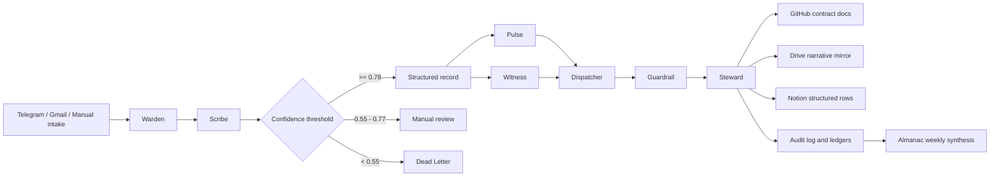
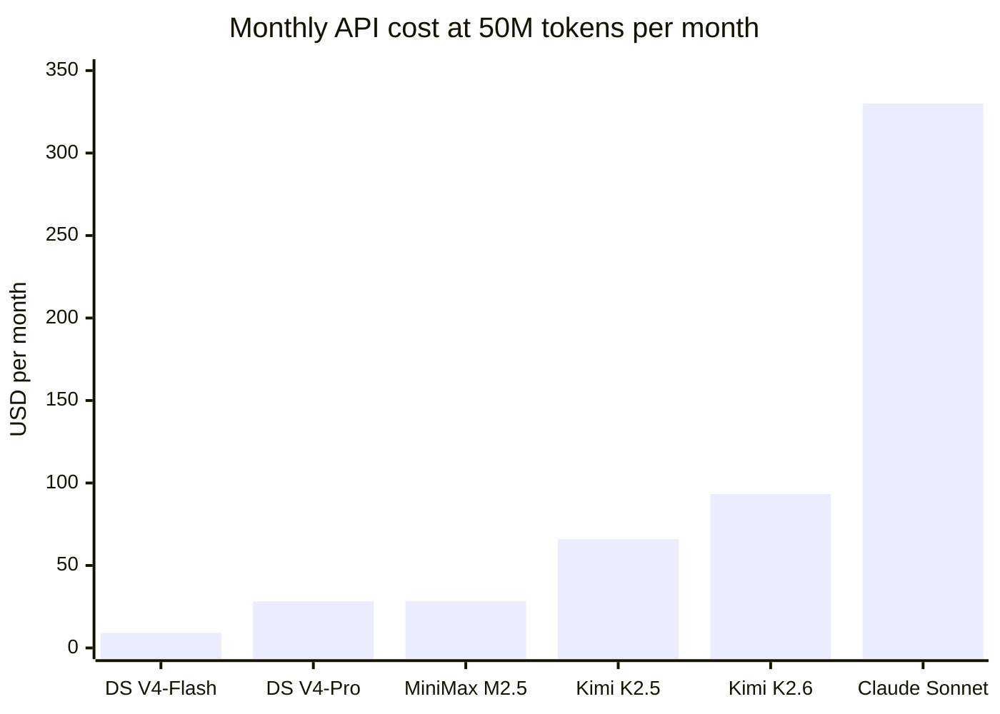
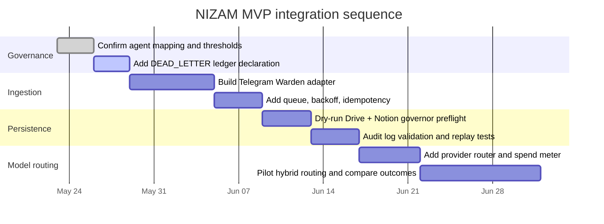

# NIZAM Hermes Architecture and 50M Token Cost Model

## Executive summary

The strongest conclusion from the pasted instruction set and the live `nizamcore` repository is that **NIZAM already has a governance and orchestration constitution**. The repository is a **local-first**, MIT-licensed scaffold with a strict distinction between public framework files and private, strict-local user data; it already defines the key operating gates, an orchestration contract, a dual-write governor, and an eight-agent conceptual map. In other words, the urgent decision is **not** “what should replace NIZAM’s orchestration,” but rather **which model providers should sit underneath the existing NIZAM contract** for inference, drafting, review, and optional agentic execution. fileciteturn4file0L3-L3 fileciteturn5file0L3-L3 fileciteturn9file0L3-L3 fileciteturn10file0L3-L3 fileciteturn12file0L3-L3

On **verified, official API pricing accessed on 2026-05-23**, a 50 million token monthly workload is **cheap on DeepSeek and MiniMax, moderate on Kimi, and materially more expensive on Claude**. Using a transparent baseline assumption of **35M input + 15M output tokens** per month, the monthly API bill is approximately **$9.10 for DeepSeek V4-Flash**, **$28.28 for DeepSeek V4-Pro**, **$28.50 for MiniMax M2.5**, **$66.00 for Kimi K2.5**, **$93.25 for Kimi K2.6**, and **$330.00 for Claude Sonnet 4.6**. That means a **pure Claude Sonnet** route already exceeds the pasted prompt’s own Year-1 “baseline” target of **under $300/month**, while the Chinese frontier APIs remain comfortably below it. fileciteturn1file0 citeturn4view0turn13view0turn19view0turn3view0turn25view0

For NIZAM specifically, the best fit is a **thin model router**, not a “Hermes monolith.” The practical recommendation is to keep NIZAM’s current governance layer intact, use a **cheap primary model** for high-volume work, and reserve **Claude Sonnet** for final synthesis, risk review, or particularly sensitive counseling/decision outputs. The cleanest budget-quality options are either **DeepSeek V4-Pro or MiniMax M2.5 as the default lane**, with **Claude Sonnet 4.6 as a reviewer lane**, or **Kimi K2.5/K2.6 for multimodal or tool-heavy tasks** where its official platform tooling is especially valuable. This preserves NIZAM’s existing no-data-loss and strict-write controls while keeping spend well below the prompt’s baseline ceiling. fileciteturn1file0 fileciteturn9file0L3-L3 fileciteturn10file0L3-L3 fileciteturn11file0L3-L3 citeturn13view0turn19view0turn25view0turn4view0

| Decision area | Highest-confidence finding | Why it matters |
|---|---|---|
| Governance | NIZAM already defines gates, write rules, durability, and agent boundaries | Do **not** let an external agent framework become system-of-record |
| Cost at 50M tokens | DeepSeek and MiniMax are an order of magnitude cheaper than Claude Sonnet on the modeled mix | Provider choice dominates spend at this scale |
| Best operating model | Cheap-primary + premium-reviewer hybrid | Preserves quality while staying inside budget |
| Maturity gap | Telegram and Gmail Warden adapters are still explicitly marked TODO in the repo | The next bottleneck is integration plumbing, not more orchestration theory |
| Hermes ambiguity | “Hermes” is still ambiguous in the pasted prompt; the repo evidence supports using it, if at all, as an optional runtime layer beneath NIZAM governance | Prevents architecture drift and duplicated control logic |

The table above synthesizes the repository contract and the pasted architecture brief. The governance findings come from `README.md`, `CRITICAL_FACTS.md`, `AGENT_MAPPING.json`, `NIZAM_ORCHESTRATION_LAYER.md`, and `CONNECTORS.json`; the budget framing comes from the pasted instruction payload. fileciteturn4file0L3-L3 fileciteturn5file0L3-L3 fileciteturn9file0L3-L3 fileciteturn10file0L3-L3 fileciteturn11file0L3-L3 fileciteturn1file0

## What the pasted prompt and the repository already fix

The repository is not an empty repo waiting for an agent framework. It already describes POP/NIZAM as a **personal operating system** with machine-readable registries, skills, ledgers, and privacy-safe scaffolding. The repo names four core Phase-1 modules, uses dual human/machine folder naming, and explicitly treats personal records as **strict-local**, never to be committed. It also establishes three inviolable gates: **HIMAYAH** for privacy, **SUKOON** for recovery-first routing, and **THABAT** for continuity. fileciteturn4file0L3-L3 fileciteturn5file0L3-L3

The orchestration layer is already defined as an **ephemeral compute runtime** that must never become the storage layer. The repo’s orchestration contract says the sandbox is wiped between sessions; every durable result must be persisted to at least one durable surface before a step is considered complete; and “it ran successfully” is false until “it is persisted.” It also defines the conceptual agent pipeline in order: **Warden → Scribe → Pulse → Witness → Dispatcher → Guardrail → Steward → Almanac**. fileciteturn10file0L3-L3

The agent mapping file makes NIZAM unusually concrete. It defines strict agent boundaries, confidence thresholds for Scribe auto-writes, and explicit gaps. Two of the most important gaps are operational, not conceptual: **Telegram intake adapter: missing**, and **Gmail intake adapter: missing**. The connectors registry repeats those gaps and binds the retry/fallback policy, dead-letter behavior, audit logging rules, and secret-scanning rules. fileciteturn9file0L3-L3 fileciteturn11file0L3-L3

That means the pasted research prompt’s own priorities are already aligned with the repo. The prompt asks for deterministic registries, immutable ledgers, recovery-first guardrails, auditability, rollback, cost control, and no uncontrolled writes. The repository already encodes those values. The correct architecture move is therefore to **extend the current contract**, not to supersede it with a separate orchestration worldview. fileciteturn1file0 fileciteturn10file0L3-L3 fileciteturn11file0L3-L3

This flowchart is a direct synthesis of the repo’s orchestration contract and agent mapping. It is not speculative: the pipeline order, thresholds, and durable-layer emphasis all come from the repository’s own docs. fileciteturn9file0L3-L3 fileciteturn10file0L3-L3 fileciteturn11file0L3-L3

## How Hermes should be interpreted in this NIZAM context

The pasted prompt explicitly says that “Hermes agent” must be resolved before recommendation, and gives multiple competing interpretations: model family, framework, hosted service, or another repo/tool. In this session, GitHub connector use was explicitly constrained to **`seifelsherbinyy/nizamcore` only**, so I could not responsibly inspect external Hermes repositories through the GitHub connector. Because of that constraint, the most defensible interpretation is **conditional**: Hermes may be a candidate runtime/orchestration abstraction, but **it cannot be allowed to own durable memory, write governance, or the ledger contract already defined in `nizamcore`**. fileciteturn1file0 fileciteturn10file0L3-L3

In practical terms, that means Hermes can sit in only one of three places. First, it can be a **model family** used as one inference option under Scribe/Witness/Dispatcher. Second, it can be a **task router or wrapper** that helps coordinate tools and sub-agents, but with all writes still passing through NIZAM’s Steward and governor rules. Third, it can be ignored entirely if it introduces overlap with the agent mapping, because the repo already has the conceptual agents and persistence contract. The one thing it should **not** become is a second source of truth. fileciteturn9file0L3-L3 fileciteturn10file0L3-L3

| Hermes interpretation | Fit with current repo | Recommendation |
|---|---|---|
| Hermes as model family | High | Safe, if treated as just another provider/model lane |
| Hermes as orchestration wrapper | Medium | Acceptable only if all durable writes still route through Steward/governor |
| Hermes as hosted “agent OS” | Low | High risk of duplicating governance and memory responsibilities |
| Hermes as system-of-record | Very low | Reject; conflicts with explicit NIZAM durability contract |

That decision matrix is an inference from the repo’s contract and the pasted prompt’s own “single source of truth” logic, so it should be read as architecture guidance rather than a claim about any specific external Hermes product. fileciteturn1file0 fileciteturn10file0L3-L3

## Verified model and pricing landscape

The cost and deployment question is unusually favorable for NIZAM because several current frontier or near-frontier APIs have become extremely cheap. DeepSeek’s official pricing page shows **DeepSeek-V4-Flash** at **$0.14 per million input tokens on cache miss** and **$0.28 per million output tokens**, and **DeepSeek-V4-Pro** at **$0.435 input / $0.87 output** at the current discounted rate; the same page shows **1M context length**, **tool calls**, **JSON output**, and both **OpenAI-format** and **Anthropic-format** base URLs. Reuters independently reported on 2026-05-23 that DeepSeek made the 75% V4-Pro cut permanent, which matches the official doc’s statement that the V4-Pro price is moving to one quarter of the original list price after the promotion window. citeturn4view0turn2news0

Moonshot’s official Kimi platform homepage lists **K2.5** at **$0.60 input / $3.00 output / $0.10 cache hit** and **K2.6** at **$0.95 input / $4.00 output / $0.16 cache hit**. Its official pricing docs also describe K2.5 and K2.6 as **multimodal**, supporting **thinking and non-thinking modes**, **dialogue and agent tasks**, **256k context**, **ToolCalls**, **JSON Mode**, **Partial Mode**, and internet search. The same homepage also exposes an unusually rich official tool layer, including **web search, memory, code runner, fetch, quick JS, Excel/CSV analysis, and date tooling**, which makes Kimi particularly attractive for deep-research or long-horizon tool-using tasks. citeturn13view0turn15view1turn15view0

MiniMax’s official pay-as-you-go page shows **MiniMax-M2.5** at **$0.30 input / $1.20 output**, with **prompt caching read at $0.03 per million tokens** and **write at $0.375 per million tokens**. The MiniMax docs position M2.5 as optimized for **code generation and refactoring**, and the docs explicitly recommend a **compatible Anthropic API** path, which is operationally useful because it lowers router and SDK friction if you want the same integration layer to point to Anthropic, DeepSeek, and MiniMax. citeturn19view0turn17view0

Anthropic’s official docs show **Claude Sonnet 4.6** at **$3 input / $15 output** and **Claude Opus 4.7** at **$5 input / $25 output**, with **1M context windows** for both latest flagship tiers. Anthropic also publishes prompt-caching pricing and states that cache reads cost **10% of the standard input price**, with 5-minute writes at **1.25x base** and 1-hour writes at **2x base**, and notes that caching already pays off after one or two reads depending on duration. This matters for NIZAM because the repo uses stable always-loaded context files and encoded skill prompts, which are exactly the kind of repeated prefixes that caching can monetize efficiently. citeturn25view0turn3view0 fileciteturn5file0L3-L3 fileciteturn7file0L3-L3

One ambiguity remains unresolved: the user prompt says “**GLM MiniMax**,” which could mean **GLM plus MiniMax**, or a shorthand grouping of Chinese frontier APIs. I was able to verify MiniMax numerically from official docs, but I could **not** verify current Z.ai/GLM pricing from an accessible, non-JS official pricing page in this session. Reuters does provide directional evidence that Zhipu raised API pricing in 2026 and positioned GLM as materially cheaper than Anthropic for migration scenarios, but that is not sufficient for a decision-grade cost line item, so I exclude GLM from the numeric model tables rather than guess. citeturn22news0turn22news1

| Provider/model | Verified current pricing | Verified integration notes | Cost posture for NIZAM |
|---|---|---|---|
| DeepSeek V4-Flash | $0.14 input miss / $0.28 output / $0.0028 cache-hit input per MTok | 1M context, tool calls, JSON output, OpenAI + Anthropic API formats citeturn4view0 | Best raw cost |
| DeepSeek V4-Pro | $0.435 input / $0.87 output / $0.003625 cache-hit input per MTok | Same compatibility pattern; Reuters says 75% cut made permanent citeturn4view0turn2news0 | Best premium-cost ratio |
| MiniMax M2.5 | $0.30 input / $1.20 output / $0.03 cache read / $0.375 cache write per MTok | Anthropic-compatible API recommended; positioned for code generation/refactoring citeturn19view0turn17view0 | Excellent coding-cost fit |
| Kimi K2.5 | $0.60 input / $3.00 output / $0.10 cache-hit per MTok | 256k context, multimodal, tool calls, JSON mode, official tool ecosystem citeturn13view0turn15view1 | Strong agentic+multimodal fit |
| Kimi K2.6 | $0.95 input / $4.00 output / $0.16 cache-hit per MTok | Same category, stronger long-context coding stability per official homepage/docs citeturn13view0turn15view0 | Better than K2.5 if quality premium is acceptable |
| Claude Sonnet 4.6 | $3 input / $15 output per MTok | 1M context, premium reviewer-quality route, mature docs/caching model citeturn25view0turn3view0 | Use selectively |
| Claude Opus 4.7 | $5 input / $25 output per MTok | Highest-cost premium lane, 1M context citeturn25view0turn3view0 | Too expensive for default routing |
| GLM | Not numerically modeled | Official price not verifiable in this session; Reuters only gives directional evidence citeturn22news0turn22news1 | Hold pending verified pricing |

## Cost model for 50M tokens per month

The cost model below uses one explicit assumption set so the numbers are auditably simple: **50M total billable tokens/month**, split as **35M input and 15M output**. This is a reasonable planning baseline for an agentic personal system where prompts, context, and repo excerpts are input-heavy, but outputs are still substantial. These are **API inference costs only**. They do **not** include storage, monitoring, web-search tool surcharges, document extraction surcharges, GPU rental, egress, or hidden orchestration overhead. The prompt you provided explicitly cares about those hidden variables; for that reason, I also include an **ESTIMATED** overhead sensitivity after the base table. fileciteturn1file0 citeturn4view0turn13view0turn19view0turn3view0turn25view0

The arithmetic is:

`Monthly API cost = (input_MTok × input_price) + (output_MTok × output_price)`

Applied to **35 MTok input + 15 MTok output**:

| Model | Monthly cost at 50M total tokens | Daily average | 24-month total at flat usage |
|---|---:|---:|---:|
| DeepSeek V4-Flash | $9.10 | $0.30/day | $218.40 |
| DeepSeek V4-Pro | $28.28 | $0.94/day | $678.48 |
| MiniMax M2.5 | $28.50 | $0.95/day | $684.00 |
| MiniMax M2.7 | $28.50 | $0.95/day | $684.00 |
| Kimi K2.5 | $66.00 | $2.20/day | $1,584.00 |
| Kimi K2.6 | $93.25 | $3.11/day | $2,238.00 |
| Claude Sonnet 4.6 | $330.00 | $11.00/day | $7,920.00 |
| Claude Opus 4.7 | $550.00 | $18.33/day | $13,200.00 |

All values in the table are calculated directly from the official provider prices cited in the previous section. The key decision implication is straightforward: at this token level, **provider choice matters far more than token volume alone**. A 50M-token month is trivial on DeepSeek and MiniMax, manageable on Kimi, but already above the prompt’s “baseline” budget when routed entirely through Claude Sonnet. fileciteturn1file0 citeturn4view0turn13view0turn19view0turn3view0turn25view0

A second sensitivity matters more than many teams expect: **output mix**. Models with low input rates but high output rates can stay cheap for planning-heavy tasks and get expensive when you let them generate a lot of long prose or code. Even at the same 50M total, moving from an **80/20** input/output split to a **60/40** split materially raises cost, especially on Claude and Kimi. The table below is still based on official token prices; only the mixes change. citeturn4view0turn13view0turn19view0turn25view0

| Model | 80/20 mix | 70/30 mix | 60/40 mix |
|---|---:|---:|---:|
| DeepSeek V4-Flash | $8.40 | $9.10 | $9.80 |
| DeepSeek V4-Pro | $26.10 | $28.28 | $30.45 |
| MiniMax M2.5 | $24.00 | $28.50 | $33.00 |
| Kimi K2.5 | $54.00 | $66.00 | $78.00 |
| Kimi K2.6 | $78.00 | $93.25 | $108.50 |
| Claude Sonnet 4.6 | $270.00 | $330.00 | $390.00 |

The most useful financial model for NIZAM is the **hybrid** one, because the repo and prompt both imply multiple lanes: ingestion, parsing, planning, critique, and synthesis need not all use the same model. If you route cheap models through repetitive internal steps and reserve Claude for final review, the economics change dramatically. fileciteturn1file0 fileciteturn9file0L3-L3 fileciteturn10file0L3-L3

| Hybrid routing assumption | Monthly cost at 50M tokens | 24-month flat total | Budget fit vs <$300 baseline |
|---|---:|---:|---|
| DeepSeek V4-Flash 80% + Claude Sonnet 20% | $73.28 | $1,758.72 | Very strong |
| DeepSeek V4-Pro 85% + Claude Sonnet 15% | $73.53 | $1,764.72 | Very strong |
| MiniMax M2.5 70% + Claude Sonnet 30% | $118.95 | $2,854.80 | Strong |
| Kimi K2.5 70% + Claude Sonnet 30% | $145.20 | $3,484.80 | Strong |
| MiniMax M2.5 60% + Kimi K2.5 20% + Claude Sonnet 20% | $96.30 | $2,311.20 | Very strong |

For NIZAM, these hybrids are more realistic than single-model operation because the repo explicitly separates roles. A cheap primary lane can cover Warden/Scribe drafting, routine Dispatcher planning, and many Almanac aggregations, while Claude is reserved for Guardrail review, contradiction handling, or high-stakes final synthesis. That is precisely the kind of bounded specialization the repo’s agent map was built to support. fileciteturn9file0L3-L3 fileciteturn10file0L3-L3

One more planning adjustment is important. If “50M tokens/month” means **final, billable provider tokens**, the tables above are directly usable. If instead it means **raw user/application tokens before orchestration overhead**, then the real bill will be higher. Given the pasted prompt’s design assumptions—**one coordinator plus two specialists for MVP**, retrieval/context injection, retries, and agent-to-agent chatter—a reasonable **ESTIMATED** planning factor is **1.3x to 1.6x**. On that basis, a $73 hybrid becomes roughly **$95 to $117/month**, while pure Claude Sonnet becomes roughly **$429 to $528/month**. That does not change the ranking; it just narrows headroom. fileciteturn1file0

Prompt caching is the final major lever. Anthropic says cache reads cost **10% of standard input** and that caching pays off after one or two reads depending on duration; DeepSeek and Kimi both publish cache-hit token pricing on their official pricing surfaces; MiniMax publishes separate prompt-caching read/write rates. Because NIZAM uses stable always-loaded files like `CRITICAL_FACTS.md` and fixed skill contracts, it is structurally more cache-friendly than a generic chatbot. In practice, that strengthens the case for **DeepSeek, MiniMax, and Claude** for repeated-prefix workflows, and lowers the effective penalty of long system prompts if implemented carefully. citeturn3view0turn4view0turn13view0turn19view0 fileciteturn5file0L3-L3 fileciteturn7file0L3-L3

## Recommended deployment and integration roadmap

The deployment recommendation is to keep NIZAM’s current architecture and add a **model router** rather than a new agent superstructure. The router should sit inside the runtime path used by Scribe, Witness, Dispatcher, Guardrail, and Almanac, while Warden, Steward, and the durable-layer contract remain repository-owned. That design stays faithful to the repo’s “sandbox is compute, never memory” rule and preserves the existing audit and dead-letter philosophy. fileciteturn10file0L3-L3 fileciteturn11file0L3-L3

The highest-confidence operating plan is this:

| Lane | Recommended model | Rationale |
|---|---|---|
| High-volume parsing, summaries, drafts, classification | DeepSeek V4-Pro **or** MiniMax M2.5 | Lowest cost with strong API compatibility and enough capability for routine structured work citeturn4view0turn19view0turn17view0 |
| Premium review, contradiction checks, final narrative synthesis | Claude Sonnet 4.6 | Better premium reasoning/synthesis lane, but too expensive for default routing citeturn25view0turn3view0 |
| Tool-heavy multimodal research or agentic experiments | Kimi K2.5 or K2.6 | Official tool stack, multimodal support, and explicit agent-task positioning citeturn13view0turn15view1turn15view0 |
| Avoid for default MVP | Claude Opus 4.7 as primary | Over-budget for the prompt’s baseline target at only 50M tokens/month fileciteturn1file0 citeturn25view0turn3view0 |

This recommendation is also operationally convenient. DeepSeek exposes both OpenAI-format and Anthropic-format endpoints, MiniMax documents Anthropic compatibility, and NIZAM’s `.env.example` already anticipates a Claude/OpenAI style runtime. That means you can add **`DEEPSEEK_API_KEY`**, **`MINIMAX_API_KEY`**, and optionally **`KIMI_API_KEY`** to the existing secret model without redesigning the repository’s control plane. The main work is adapter/router configuration, not architectural reinvention. fileciteturn13file0L3-L3 citeturn4view0turn17view0

The immediate implementation priority is not model benchmarking. It is finishing the missing plumbing that the repo itself marks as incomplete: **Telegram adapter**, **Gmail adapter**, and a formally declared **Dead Letter ledger**. Only after those exist does it make sense to optimize which model drafts what. The repo is explicit that Telegram and Gmail intake are not scaffolded yet, and that `DEAD_LETTER.jsonl` still needs a formal ledger declaration. fileciteturn9file0L3-L3 fileciteturn11file0L3-L3

Telegram can support the MVP cleanly, but the implementation should follow Telegram’s current operational guidance. Telegram documents two update modes—**long polling** and **webhooks**—and notes that bots must use supported webhook ports and should secure webhook routes with a secret path. It also warns about rate limits: roughly **1 message per second in a single chat**, **20 messages per minute in a group**, and roughly **30 messages per second for unpaid bulk broadcasts**, with **429** responses when limits are exceeded. That is more than enough for an MVP NIZAM bot, but it argues for **queued outbound delivery**, **idempotency**, and **digest mode** over noisy real-time chatter. citeturn24view0turn24view1

This is the roadmap I would treat as “decision grade” given the evidence. It follows the repo’s existing contract instead of inventing a second one, and it sequences work around the actual bottlenecks exposed by the repository: missing adapters, dead-letter formalization, persistence validation, and then model routing. fileciteturn9file0L3-L3 fileciteturn10file0L3-L3 fileciteturn11file0L3-L3 fileciteturn12file0L3-L3

## Open questions and limitations

The most important unresolved item is **GLM pricing**. I was able to verify DeepSeek, MiniMax, Kimi, and Claude from official provider-owned pages, but I could not retrieve a usable non-JS official price surface for Z.ai/GLM in this session. Because the pasted prompt is decision-sensitive and explicitly forbids invented cost claims, GLM is intentionally left out of the numeric tables. Reuters supports the directional claim that Zhipu priced below Anthropic and later raised prices in 2026, but not a trustworthy line-item cost model. citeturn22news0turn22news1

“Hermes” also remains partially unresolved as an external product identity. The pasted brief requires identity resolution, but the GitHub-access constraint in this session allowed repository-connected research only on **`seifelsherbinyy/nizamcore`**. Within that constraint, the strongest safe inference is architectural: **whatever Hermes is, it should not displace NIZAM’s existing governance and durability layers**. That conclusion is robust even though a broader external Hermes repo review was out of scope here. fileciteturn1file0 fileciteturn10file0L3-L3

Finally, this report models **API usage costs**, not **self-hosted GPU rental TCO**. That is deliberate rather than accidental: the official, current token prices were verifiable and already sufficient to show that the decision boundary for NIZAM MVP is mostly a **routing problem**, not a hosting-cost problem. If you later want a self-host vs API breakeven analysis, that should be run as a separate, fresh pricing pass with current GPU rental and cloud quotes rather than inferred from stale assumptions. fileciteturn1file0 fileciteturn10file0L3-L3